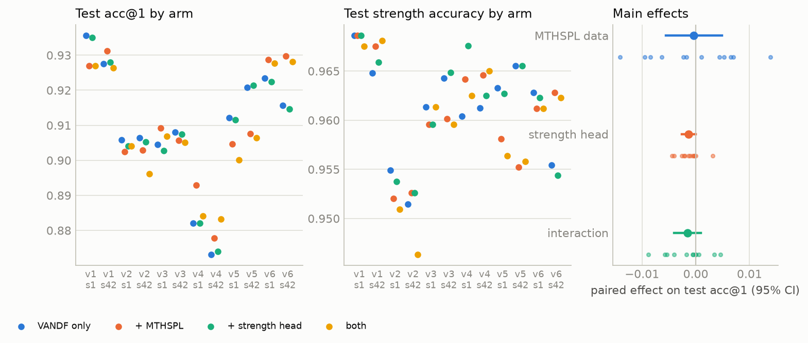
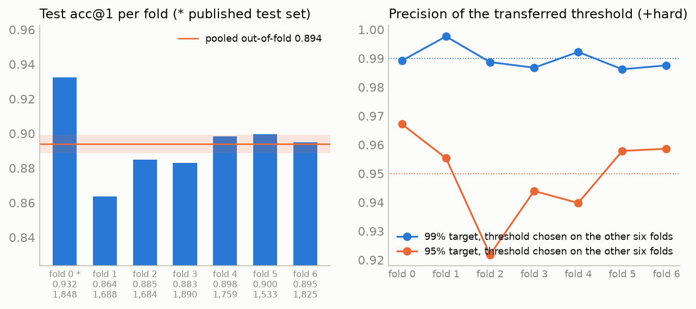

# Three Interventions on a VA-to-RxNorm Drug-Name Mapper: A Second Source Vocabulary, an Auxiliary Strength Head, and Cross-Validation by Ingredient

| created | modified | status | confidence | importance |
|---|---|---|---|---|
| 2026-09-14 | 2026-09-15 | finished | likely[^conf] | 3 |

> **Abstract.** The [first report](https://kettlelabs.dev/blog/posts/vandf-rxnorm-biencoder/) (hereafter Part I) fine-tuned a small bi-encoder to map VA National Drug File (VANDF) names to RxNorm clinical drugs and, by re-drawing the ingredient-level split five additional times, estimated its accuracy on unseen ingredients at 0.907 ± 0.019, against 0.931 on the published draw. Its concluding section listed interventions expected to change that figure. This report evaluates three of them under the same design: every arm is trained on each of the same six ingredient draws and two training seeds, and an effect is credited only if it exceeds the split-to-split spread of about two points rather than the value on a single favourable draw. The interventions are (1) a second source vocabulary from the same RxNorm release, the FDA Structured Product Label names (MTHSPL), which is the only large source at UMLS restriction level 0 other than the two already used, and which contributes 48,985 labelled pairs whose surface form differs substantially from the VA's; (2) an auxiliary classification head, trained jointly and discarded at inference, that predicts the target's strength from the query embedding ([Caruana 1997](#references)), directed at the error category shared by every earlier model; and (3) seven-fold cross-validation by ingredient ([Stone 1974](#references)), which yields a single out-of-fold estimate over every held-out string, a final model trained on every ingredient family, and a test of whether abstention thresholds chosen on one set of folds transfer to another. A pilot on the published split found that the head's loss is approximately fifty times the contrastive loss at initialization and that every weight above 0.01 lowers validation accuracy monotonically; the factorial grid therefore runs the head at 0.01. Neither training intervention changes accuracy on VA strings. Over twelve paired (draw, seed) units, the SPL strings change VA test acc@1 by −0.0003 (95% CI −0.006 to +0.005; 6 of 12 units positive) and the head by −0.0013 (−0.003 to 0.000; 1 of 12), and the head leaves unchanged the strength accuracy it was designed to raise. The SPL strings do raise accuracy on held-out SPL strings, from 0.709 to 0.833 (+0.123; 12 of 12), and a control capped at 9,300 SPL rows retains all of that increase on the two draws on which it was run. Seven-fold cross-validation of the VA-only recipe gives a pooled out-of-fold acc@1 of 0.894 (Wilson 95% 0.889–0.899, n = 12,227), within the six-draw band, and a 99%-precision threshold chosen on six folds achieves between 0.986 and 0.998 on the seventh. The grid also revises one estimate of Part I: on the A100 the training seed contributes a standard deviation of 0.0045 in test acc@1, not 0.001, so the split contributes about four times the seed's standard deviation rather than twenty.

## 1. Question and design

Part I established the reference measurement. Its final recipe, SapBERT ([Liu et al 2021](#references)) fine-tuned with the in-batch softmax loss of [Henderson et al 2017](#references), ingredient-matched hard negatives, and a deterministic rule that appends RxNorm-style concentrations to the VA string, reached test acc@1 0.931 on the published ingredient split and 0.907 ± 0.019 across six draws of that split, with training-seed variation of 0.001. The ratio between those two sources of variation determines the design of the present report. [Bouthillier et al 2021](#references) found, across a range of benchmarks, that the choice of data split contributes more variance than the choice of training seed, often by a wide margin; the same held on this task, by a factor of about twenty in standard deviation (§5.1 revises this to about four). An intervention that changes acc@1 by one point on one split has therefore demonstrated nothing. The one factor of the earlier sweep whose effect fell within the split spread, hard negatives, was re-run on all six draws and held on each; that re-run's design is applied here from the outset. Every arm is trained on every draw, the analysis is paired within draw, and each effect is reported with its sign count over the units and a 95% interval, following [Dietterich 1998](#references) on comparing learners on common folds.

The three interventions correspond to items 4, 3, and 1 of Part I §7. Two are training-time interventions and are run as a single 2 × 2 factorial grid; the third changes how the final model is trained and evaluated, and is run afterwards using whichever arm of the grid performs best.

**A second source vocabulary.** The construction that produced the dataset applies to any RxNorm source: an atom that shares an RXCUI with a normalized clinical-drug name is a labelled pair, curated by NLM ([Nelson et al 2011](#references)). The September 2026 release carries thirteen sources, and the UMLS license assigns each a restriction category ([Bodenreider 2004](#references); [NLM license appendix](https://www.nlm.nih.gov/research/umls/knowledge_sources/metathesaurus/release/license_agreement_appendix.html)). Only category-0 content may be included in a redistributed dataset or model, which excludes the commercial drug databases and SNOMED CT and leaves one large candidate, described in §3. The hypothesis, in the sense of [Halevy et al 2009](#references), is that a fourfold increase in training strings drawn from a different naming convention improves the encoder's representation of product names more than any modification to the loss.

**An auxiliary strength head.** Strength was the largest error category of every model in Part I: three-quarters of TF-IDF's errors, six in ten of MiniLM's, and the largest single share of the final model's 128, a portion of which are underdetermined by the input string. The bi-encoder receives no explicit representation of strength; it learns only that a query containing `250MG` tends to match a target containing `250 MG`. Multi-task learning ([Caruana 1997](#references); [Ruder 2017](#references)) suggests a remedy: attach a small classifier to the query embedding that must predict the target's strength string, train it jointly with the retrieval objective, and discard it at inference. If the shared encoder is thereby required to represent strength explicitly, retrieval should benefit. This was deferred in Part I because the strength, ingredient, and dose form are already available from the retrieved candidate's labels; the question here is whether they are also useful as a training signal.

**Cross-validation by ingredient, and a model trained on every ingredient family.** The published model was trained on 70% of ingredient families: 15% were held out for validation and 15% for test. A deployed mapper has no reason to exclude them. Cross-validation ([Stone 1974](#references); [Kohavi 1995](#references)) is the standard procedure: partition the ingredients into K folds, train K models each with one fold held out, pool the K held-out scores into a single estimate over every string, then train a final model on all data and report the pooled estimate for it. Two further quantities follow. The pooled estimate carries a sampling interval over roughly 12,000 strings rather than a six-draw band whose own width is known only to a factor of two. And the K models' held-out predictions are exactly the material required to fit the calibration layer on strings the final model was not trained on, which also addresses item 1 of Part I §7: whether a 99%-precision threshold chosen on six folds holds on the seventh.

## 2. Hypotheses

Recorded before any run of the grid had started. The pilot of §4.2 selected one quantity, the head's loss weight, and nothing else; it was run on the published split alone and is not part of the paired analysis.

- **H1.** MTHSPL training strings raise VA test acc@1 by a small amount, about one point, within the split band but of consistent sign across the twelve (split, seed) units; and they raise accuracy on held-out MTHSPL strings by a large amount, because the VA-only model has never encountered the FDA naming convention.
- **H2.** The strength head lowers the VA strength-error rate and does not change ingredient or dose-form accuracy; its effect on acc@1 is small and may not exceed the split spread.
- **H3.** The two effects are additive: the interaction term is indistinguishable from zero.
- **H4.** The compute-matched control (VA strings only, sixteen epochs) gains less than the MTHSPL arm, and the size-matched control (MTHSPL capped at the VA row count) retains most of the MTHSPL gain. The effect is therefore attributable to the additional strings rather than to the additional optimizer steps or the additional rows.
- **H5.** The pooled out-of-fold acc@1 of the recipe falls within 0.907 ± 0.019, and a 99%-precision threshold chosen on six folds achieves at least 98% precision on the seventh, as the single-split thresholds achieved on their test set.

## 3. Data

### 3.1 The candidate sources

`RXNSAB` records each source's restriction category in its `SRL` column. Applying the license and a size requirement together leaves a short list:

| Source | Description | SRL | Active atoms linked to an SCD/SBD | Distinct strings | Targets covered |
|---|---|---|---|---|---|
| RXNORM | NLM's normalized names (the target side) | 0 | 91,762 | 78,903 | 27,287 |
| **MTHSPL** | **FDA Structured Product Label names** | **0** | **101,005** | **49,036** | **16,000** |
| NDDF | FDB MedKnowledge | 3 | 30,706 | 22,541 | 9,495 |
| GS | Gold Standard | 3 | 22,593 | 21,186 | 12,927 |
| MMSL | Multum | 1 | 22,048 | 22,048 | 15,016 |
| MMX | Micromedex | 3 | 20,645 | 20,620 | 14,734 |
| VANDF | VA National Drug File (the query side) | 0 | 17,964 | 14,931 | 8,315 |
| SNOMEDCT_US | SNOMED CT | 9 | 14,036 | 14,036 | 6,219 |
| CVX | vaccine codes | 0 | 187 | 187 | 181 |
| MTHCMSFRF | CMS formulary reference | 0 | 3 | 3 | 3 |
| ATC, DRUGBANK, USP | classifications and monographs | 0 | 0 | 0 | 0 |

MTHSPL comprises the drug-product names from FDA Structured Product Labeling ([FDA SPL](https://www.fda.gov/industry/fda-data-standards-advisory-board/structured-product-labeling-resources)), which NLM ingests into RxNorm ([NLM RxNorm technical documentation](https://www.nlm.nih.gov/research/umls/rxnorm/docs/techdoc.html)). It is the largest source in the table, it is category 0, and exactly one of its 49,036 strings equals a VA string under case-insensitive comparison. The next three sources exceed the VA file in size but are category 1 or 3, and their inclusion would invalidate the published dataset card's statement that no restricted content was used. CVX and MTHCMSFRF are category 0 and contribute 190 strings between them, too few to justify a third source. The comparison is therefore VANDF alone against VANDF with MTHSPL.

The two naming conventions differ substantially. A VA name is short and abbreviated (`PAROXETINE HCL 40MG TAB`, median 34 characters); an SPL name is long, unabbreviated, and carries the brand in brackets:

| MTHSPL string | Target |
|---|---|
| `PAROXETINE HYDROCHLORIDE 40 mg ORAL TABLET, FILM COATED [Paroxetine]` | `paroxetine hydrochloride 40 MG Oral Tablet` |
| `CAMPHOR (SYNTHETIC) 35 mg in 1 g / MENTHOL 60 mg in 1 g TOPICAL PATCH [Arcticzen]` | `camphor 0.035 MG/MG / menthol 0.06 MG/MG Medicated Patch [Arcticzen]` |

The median SPL string is 66 characters and the 99th percentile 240, against a 96-token limit chosen for the VA; the bracketed brand at the end of the longest one to two percent of strings is truncated. The limit was left unchanged so that the comparison is not confounded. The `X mg in 1 mL` notation is not parsed by the strength normalizer, so the rule has no effect on SPL strings; that too was left unchanged, for the same reason.[^normalizer]

### 3.2 Pairing and splitting

The same term-type filter applies as for the VA: `DP` (drug product) atoms only, with NLM's generated `MTH_RXN_DP` duplicates excluded as `MTH_RXN_CD` was. After deduplication on (string, target) this yields 48,985 pairs over 47,635 distinct strings and 16,000 targets, together with 21,595 active SPL strings whose concept has no SCD/SBD; the latter join the unmatched set and are divided between validation and test by the same string hash.

No new split rule is required. The published split assigns every ingredient to train, validation, or test by an MD5 hash of its RXCUI, and a *target* follows its ingredients; query strings inherit the target's assignment. MTHSPL strings therefore fall into the six existing draws without further specification, each VA test set is byte-identical with or without the SPL strings present, and only train-split SPL strings are ever trained on. On the published draw this adds 29,505 training rows to the VA's 9,290; the other five draws add between 30,218 and 33,681.

One case required a rule. Eleven SPL strings across three draws (six in v3, four in v4, one in v5) map to two products whose ingredients were assigned to different splits, a condition no VA string meets on any draw. Such a string can be neither trained on, since that would expose a held-out ingredient, nor scored, since one of its correct answers is in the training set. The loader drops them and reports the count.[^straddle]

### 3.3 Folds

The published salt hashes each ingredient into a bucket from 0 to 99 and assigns buckets 0–14 to test and 15–29 to validation. Seven folds of the same hash, with fold = ⌊7 × bucket / 100⌋, make fold 0 exactly buckets 0–14, which is the published test set. Fold i is tested with fold i+1 as its validation set and the remaining five as training, so each model is trained on 71% of ingredient families, as the published model was. The `mixed` rule is unchanged: a target whose ingredients span the three sets is excluded from that fold. This is what limits out-of-fold coverage, since a combination drug whose ingredients sit in different folds is mixed in two rotations and training data in the rest, and is never tested. The seven test sets contain 1,848, 1,688, 1,684, 1,890, 1,759, 1,533, and 1,825 VA strings: 12,227 of the 14,369 distinct VA strings, and 12,230 of the 14,372 pairs, since three strings in fold 6 each have two correct targets. The final model's data folder assigns every ingredient to train, and no target is mixed.

## 4. Method

### 4.1 The grid and its controls

One W&B grid (`sweeps/levers.yaml`): the final recipe, unchanged, crossed with {VA only, VA + MTHSPL}, {no head, strength head}, the six draws, and seeds 42 and 1, for 48 runs on one Colab A100. Selection, where required, is on `val/acc@1` as before. The `val` and `test` keys retain their meaning, the VA strings of that draw, and the SPL strings of the same draw are scored alongside under separate keys, so the VA-only arm reports SPL transfer, item 4 of Part I §7, without additional runs. Epochs are fixed at four for both data arms; the SPL arm therefore takes about four times as many optimizer steps. Two controls on the best and worst of the six draws (v1 and v4) separate the confounds: VA only for sixteen epochs (about the SPL arm's number of optimizer steps, on the VA arm's strings), and VA plus 9,300 SPL rows for four epochs (as many SPL rows as VA rows, hence twice the VA arm's steps and about half the SPL arm's).

Analysis is paired within (split, seed), giving twelve units. Each main effect is the mean of the two simple contrasts per unit, the interaction is the double difference, and each is reported with a sign count and a t interval over the twelve. [Nadeau and Bengio 2003](#references) show that units sharing training data are correlated and that such intervals are optimistic, which is why the sign count is reported alongside them.

### 4.2 The strength head, and the pilot that set its weight

The head is one linear layer on the query embedding, 768 inputs and one output per strength class, trained by cross-entropy against the strength string of the positive (`250 MG`, `0.025 MG/ML`, or the ` / `-joined list for a combination product). The classes are the strengths with at least five training examples: 232 of them cover 79% of VA training rows. The remaining rows contribute no head loss, in preference to an OTHER class that would hold a fifth of the rows and train the head toward an uninformative cluster. The head is a parameter of the loss module rather than the model, so the trainer's optimizer updates it and `model.save()` never writes it; the saved encoder, the inference wrapper, and the code path of every published number are unchanged. Its initialization is seeded independently of the training stream, so the two arms of a given seed see identical batches.

The weight on the head loss is the one hyper-parameter with no precedent in this project, and the pilot showed it to be decisive. A 232-way cross-entropy begins near 4 nats; the contrastive loss is near 0.09 after warm-up and 0.03 at the end of training. At weight 0.2 the head is the dominant objective and the retrieval loss a regularizer, an inversion of the intended roles. The literature on weighting auxiliary losses ([Kendall et al 2018](#references)) and on conflicting task gradients ([Yu et al 2020](#references)) establishes the general point; the specific value required a pilot. Four weights were run on the published split, seed 42, VA strings only, with everything else as in the final recipe, and the split-v1 run of Part I §5.8 (`lqf7dett`, same GPU) as the reference:

| head weight | run | val acc@1 by epoch | best val acc@1 | test acc@1 | strength | ingredient | dose form |
|---|---|---|---|---|---|---|---|
| none | `lqf7dett` | – | 0.882 | 0.931 | 0.961 | 0.983 | 0.972 |
| 0.01 | `tiotc7iy` | 0.877 → 0.876 → **0.880** → 0.880 | 0.880 | 0.928 | 0.963 | 0.985 | 0.970 |
| 0.05 | `9zw6jvov` | **0.874** → 0.870 → 0.872 → 0.872 | 0.874 | 0.923 | 0.962 | 0.983 | 0.969 |
| 0.2 | `0usjnp44` | 0.859 → **0.864** → 0.850 → 0.848 | 0.864 | 0.904 | 0.963 | 0.975 | 0.964 |
| 0.5 | `spja8f8i` | **0.849** → 0.842 → 0.821 → 0.811 | 0.850 | 0.890 | 0.957 | 0.973 | 0.956 |

The response is monotone. As the weight increases, validation accuracy falls, the best epoch arrives earlier, and ingredient and dose-form accuracy decline, while strength accuracy, the quantity the head targets, does not change at any weight. At 0.01 the two losses are of comparable magnitude and the run is indistinguishable from the reference. The grid tests H2 at 0.01, the largest weight that is not already inferior to no head on one split. A null result at that weight answers H2 as stated, and the pilot already constrains how a positive result would have to be interpreted.

### 4.3 Folds and the final model

Each fold trains the best-performing arm of the grid, selects its epoch on its validation fold, scores its test fold once, and logs every string's top-20 candidates and cosine similarities, matched and unmatched, as an artifact. The out-of-fold table pools the seven test folds: one acc@1 with a Wilson interval ([Wilson 1927](#references)) over 12,227 strings, alongside the per-fold values and their dispersion, which is the 0.907 ± 0.019 band measured by a different procedure. The final model trains on the all-ingredient folder for the median best epoch of the seven, since it has no validation set on which to stop, and its weights are logged from Colab under a new artifact name so that the published model's `latest` pointer is unchanged.

### 4.4 Calibration on out-of-fold predictions

Part I fit a temperature and a Platt layer ([Guo et al 2017](#references); [Platt 1999](#references)) on one validation split and chose thresholds there; the 99% target then achieved 98.2–98.8% on test, and §7 asked whether that shortfall is stable. The pooled out-of-fold predictions are the appropriate material: every matched string was scored by a model not trained on its ingredients, and every hard unmatched string (a real drug with no clinical-drug concept) is assigned to one fold by a hash of its text so that it is counted once. Temperature and Platt parameters are fit on that pool and shipped with the final model as its `calibration.json`, the same four-number layer the published model carries. The check of interest follows [Varma and Simon 2006](#references): for each fold, the 95% and 99% thresholds are chosen on the other six and applied to it, and the achieved precision and coverage are tabulated, together with the full seven-by-seven matrix of thresholds chosen on fold i and applied to fold j. If the leave-one-fold-out precision matches the single-split test result, the shortfall is a property of the task and can be budgeted for; if it varies across folds, the thresholds are draw-specific and a deployment should re-select them on its own data.

## 5. Results

### 5.1 The grid

All 48 cells completed; the sweeps are listed in §7 and the failed cells and their re-runs in Appendix A. Test acc@1 per unit and arm, with validation acc@1 in parentheses (`outputs/levers/levers.md`):

| draw | seed | VA only | + SPL | + head | + SPL + head | SPL − VA only | head − VA only |
|---|---|---|---|---|---|---|---|
| v1 | 42 | 0.927 (0.885) | 0.931 (0.875) | 0.928 (0.883) | 0.926 (0.869) | +0.004 | +0.001 |
| v1 | 1 | 0.936 (0.878) | 0.927 (0.882) | 0.935 (0.878) | 0.927 (0.882) | −0.009 | −0.001 |
| v2 | 42 | 0.906 (0.914) | 0.903 (0.916) | 0.905 (0.914) | 0.896 (0.913) | −0.003 | −0.001 |
| v2 | 1 | 0.906 (0.916) | 0.902 (0.924) | 0.904 (0.914) | 0.904 (0.923) | −0.003 | −0.002 |
| v3 | 42 | 0.908 (0.914) | 0.906 (0.921) | 0.907 (0.914) | 0.905 (0.919) | −0.002 | −0.001 |
| v3 | 1 | 0.905 (0.914) | 0.909 (0.924) | 0.903 (0.914) | 0.907 (0.919) | +0.005 | −0.002 |
| v4 | 42 | 0.873 (0.908) | 0.878 (0.904) | 0.874 (0.906) | 0.883 (0.901) | +0.005 | +0.001 |
| v4 | 1 | 0.882 (0.904) | 0.893 (0.899) | 0.882 (0.903) | 0.884 (0.897) | +0.011 | +0.000 |
| v5 | 42 | 0.921 (0.903) | 0.908 (0.901) | 0.921 (0.899) | 0.906 (0.902) | −0.013 | +0.001 |
| v5 | 1 | 0.912 (0.897) | 0.905 (0.902) | 0.912 (0.896) | 0.900 (0.897) | −0.007 | −0.001 |
| v6 | 42 | 0.916 (0.878) | 0.930 (0.885) | 0.915 (0.878) | 0.928 (0.883) | +0.014 | −0.001 |
| v6 | 1 | 0.923 (0.885) | 0.929 (0.898) | 0.922 (0.883) | 0.928 (0.891) | +0.005 | −0.001 |
| **mean ± sd** | | 0.910 ± 0.018 (0.900) | 0.910 ± 0.016 (0.902) | 0.909 ± 0.018 (0.898) | 0.908 ± 0.016 (0.900) | | |

Each main effect is the mean of its two simple contrasts within a unit (§4.1), and each interval is a t interval over the twelve units:

| effect | metric | mean | 95% CI | units positive |
|---|---|---|---|---|
| SPL strings | VA test acc@1 | −0.0003 | −0.006 to +0.005 | 6 / 12 |
| | VA val acc@1 | +0.0020 | −0.002 to +0.006 | 9 / 12 |
| | VA test recall@5 | +0.0017 | −0.001 to +0.005 | 8 / 12 |
| | VA test strength accuracy | −0.0013 | −0.004 to +0.002 | 3 / 12 |
| | SPL test acc@1 | **+0.1230** | +0.100 to +0.146 | 12 / 12 |
| strength head | VA test acc@1 | −0.0013 | −0.003 to 0.000 | 1 / 12 |
| | VA val acc@1 | −0.0020 | −0.003 to −0.001 | 0 / 12 |
| | VA test strength accuracy | −0.0001 | −0.001 to +0.001 | 5 / 12 |
| | VA test ingredient accuracy | −0.0008 | −0.002 to 0.000 | 3 / 12 |
| | VA test dose-form accuracy | −0.0001 | −0.001 to +0.001 | 6 / 12 |
| | SPL test acc@1 | +0.0006 | −0.004 to +0.005 | 5 / 12 |
| interaction | VA test acc@1 | −0.0015 | −0.004 to +0.001 | 4 / 12 |
| | VA val acc@1 | −0.0017 | −0.003 to 0.000 | 2 / 12 |



*Figure 1. Test acc@1 (left) and test strength accuracy (centre) for the four arms on each (draw, seed) unit, and the three paired effects on test acc@1 with their 95% intervals (right; the small markers are the twelve per-unit values). Data: `figures/data.json`; runs in sweeps `nypttmi8`, `ad9nakej`, `2v3am5xr`, `94onbtb5`, and `zcsece1l`.*

**The SPL strings.** Their effect on VA test accuracy is indistinguishable from zero: the 95% interval, −0.006 to +0.005, excludes the one-point increase that H1 predicted. On validation, the quantity on which selection is made, the effect is +0.0020 with 9 of 12 units positive and an interval that includes zero. The per-unit contrast has a standard deviation of 0.0082 over the twelve units, larger than the 0.0064 that the seed variation estimated below would produce for a difference of two runs; its sign agrees between the two seeds on four of the six draws, and its mean per draw ranges from −0.010 (v5) to +0.010 (v6). The additional strings therefore shift VA test accuracy on individual draws by up to one point in either direction, and the shifts average to zero across draws.

**The strength head.** The head leaves strength accuracy unchanged (−0.0001, 5 of 12) and lowers acc@1: by 0.0013 on test (1 of 12 units positive; the interval's upper end is −0.00002) and by 0.0020 on validation (0 of 12; t = −5.7). Ingredient accuracy falls by 0.0008 (3 of 12) and dose-form accuracy does not change. The decrease on validation, 0.0020, is a ninth of the split standard deviation (0.018) and less than half the seed standard deviation (0.0043), and it is resolved only because the two arms of a unit share the seed and therefore the batches, which reduces the standard deviation of the paired contrast to 0.0012 on validation. The monotone response of the pilot (§4.2) thus extends to the smallest weight tested: at 0.01 the head does not improve the quantity it predicts and lowers validation accuracy by 0.2 points.

**The interaction.** −0.0015 on test (−0.004 to +0.001) and −0.0017 on validation (−0.003 to 0.000, 2 of 12). Neither interval excludes zero. Because both main effects are close to zero, additivity is the expected outcome, and the test carries little information about how the two interventions would combine if either had an effect.

**Seed variation on the A100.** Every arm was trained at two seeds on each draw, which gives 24 same-draw pairs from which the variation due to the seed alone can be estimated. The pooled standard deviation of a single run's test acc@1 is 0.0045 (validation 0.0043). The between-draw standard deviation of the VA-only arm, corrected for the seed variation that remains in a two-seed mean, is 0.018, in agreement with Part I's 0.019. Part I §5.8 estimated the seed's standard deviation at 0.001 from three seeds on the published draw on the GTX 1070; a standard deviation estimated from three values is known only to within a factor of about 0.5 to 6, and the present estimate lies within that range. Re-runs at the same seed agree to within 0.0005 (the three duplicated v6 cells, Appendix A), so the variation is due to the seed and not to nondeterminism in the software. The draw therefore contributes about four times the seed's standard deviation, not twenty. Part I's conclusion that the split dominates is unchanged, but a single run's acc@1 carries about ±0.009 (two standard deviations) from the seed alone, which is the magnitude of the per-unit SPL effects above.

### 5.2 The controls

One run per control on the best and the worst draw (v1, v4), seed 42, against the corresponding cells of the grid (`outputs/levers/levers.md`):

| run | training rows per epoch (× VA arm) | epochs | v1 VA test | v1 VA val | v1 SPL test | v4 VA test | v4 VA val | v4 SPL test |
|---|---|---|---|---|---|---|---|---|
| VA only | 1 | 4 | 0.927 | 0.885 | 0.664 | 0.873 | 0.908 | 0.667 |
| VA + all SPL | 4.2 | 4 | 0.931 | 0.875 | 0.843 | 0.878 | 0.904 | 0.776 |
| VA only, sixteen epochs (steps control) | 1 | 16 | 0.932 | 0.886 | 0.620 | 0.891 | 0.907 | 0.611 |
| VA + 9,300 SPL (size control) | 2 | 4 | 0.927 | 0.877 | 0.838 | 0.896 | 0.906 | 0.781 |

H4 was stated in terms of a gain on VA strings, and §5.1 finds none, so on VA strings the controls have no effect to decompose. On v1 the four VA test values lie between 0.927 and 0.932. On v4 the steps control and the size control exceed the VA-only arm by 0.018 and 0.023 on test, while their validation accuracy is unchanged (0.907 and 0.906, against 0.908). These are single runs at one seed; on v4 the two seeds of the grid's SPL arm differ by 0.015 on test, so differences of this size on one draw at one seed are of the same order as the seed variation observed on that draw, and the validation result, on which selection is made, does not change.

On SPL strings the controls separate the three explanations. The size control, trained on about 30% of the available SPL rows, retains the whole transfer increase: 0.838 against 0.843 on v1, and 0.781 against 0.776 on v4. The steps control, which trains four times as long on VA strings only, lowers SPL accuracy below that of the VA-only arm (0.620 against 0.664; 0.611 against 0.667). The transfer increase is therefore attributable to the SPL strings, not to the additional optimizer steps or to the additional rows, and on these two draws it is reached with 9,300 SPL rows or fewer. Additional training on one naming convention reduces accuracy on the other.

### 5.3 SPL transfer

The SPL strings of each draw are scored alongside the VA strings, 5,132 to 7,807 held-out SPL strings per draw, so every arm reports transfer to the second naming convention. The VA-only recipe maps held-out SPL strings at acc@1 0.709 ± 0.057 over the twelve units, 20 points below its accuracy on VA strings. This answers item 4 of Part I §7 for one other naming convention: an encoder fine-tuned on VA names maps long-form label names of the same products at 78% of its accuracy on VA names. Training on SPL strings raises SPL accuracy to 0.833 ± 0.036 (+0.123; 12 of 12 units) and SPL validation accuracy from 0.733 to 0.841, and raises strength accuracy on SPL strings from 0.840 to 0.919 (+0.076; 12 of 12). The head has no effect on transfer (+0.0006; −0.004 to +0.005).

The SPL-trained model remains less accurate on SPL strings than on VA strings (0.833 against 0.910), although SPL strings make up about three-quarters of its training rows. Two preprocessing choices were held at their VA settings to avoid a confound (§3.1): the 96-token limit, which truncates the longest one to two percent of SPL strings, and the strength normalizer, which does not parse the `X mg in 1 mL` notation. The remaining strength gap on SPL strings, 0.919 against 0.961 on VA strings, is consistent with the second.

### 5.4 Folds and the final model

The seven fold models train the VA-only recipe (Appendix B), seed 42, with epoch selection on the validation fold (`outputs/kfold/oof.md`):

| fold | test n | best epoch | val acc@1 | test acc@1 | test recall@5 | strength | dose form | ingredient |
|---|---|---|---|---|---|---|---|---|
| 0 (published test set) | 1,848 | 1 | 0.870 | 0.932 | 0.988 | 0.966 | 0.972 | 0.986 |
| 1 | 1,688 | 1 | 0.898 | 0.864 | 0.967 | 0.925 | 0.958 | 0.966 |
| 2 | 1,684 | 3 | 0.887 | 0.885 | 0.983 | 0.970 | 0.951 | 0.986 |
| 3 | 1,890 | 3 | 0.908 | 0.883 | 0.980 | 0.966 | 0.967 | 0.975 |
| 4 | 1,759 | 1 | 0.895 | 0.898 | 0.960 | 0.947 | 0.977 | 0.992 |
| 5 | 1,533 | 3 | 0.902 | 0.900 | 0.967 | 0.932 | 0.967 | 0.983 |
| 6 | 1,825 | 1 | 0.937 | 0.895 | 0.975 | 0.960 | 0.970 | 0.983 |
| **pooled out-of-fold** | **12,227** | | | **0.894** | 0.975 | | | |



*Figure 2. Test acc@1 of each fold model on its held-out fold, with the pooled out-of-fold estimate and its Wilson 95% interval (left; the numbers under each bar are the fold's test acc@1 and its number of test strings), and the precision achieved on each fold by thresholds chosen on the other six, at the 95% and 99% targets, on the +hard population (right). Data: `figures/data.json`; runs in W&B group `kfold-k7`.*

The fold 0 model trains on nearly the published training set (bucket 29 moves from validation to training) and is tested on the published test set; it scores 0.932, against the published 0.931. The pooled out-of-fold acc@1 is 0.894 (10,932 of 12,227; Wilson 95% 0.889–0.899), with recall@5 0.975. The test folds cover 85.1% of the 14,369 distinct VA strings; the remainder are combination drugs whose ingredients fall in different folds (§3.3).

Across folds, test acc@1 is 0.894 ± 0.021, range 0.864–0.932. Binomial sampling at these sizes accounts for 0.007 of that standard deviation, which leaves 0.020 attributable to which ingredients are held out. The six-draw estimate of Part I, obtained from six different hashes rather than seven contiguous ranges of one hash, was 0.907 ± 0.019 with 0.018 attributable to the draw; the two procedures agree. They also agree that the published test set is the most favourable partition: 0.932 is the largest of the seven folds, as 0.931 was the largest of the six draws, 3.8 and 2.4 points above the respective means. The pooled estimate lies 0.013 below the six-draw mean, inside the band.

The best epochs of the folds are 1, 1, 3, 3, 1, 3, and 1, and the differences between epochs on validation are small (fold 0: 0.870 at the first epoch, 0.864–0.866 at the later three). The all-data model therefore trained for one epoch, the median, on all 14,369 VA strings (run `qwn31tzn`; artifact `vandf-rxnorm-biencoder-final-all`, whose version `v1` adds the calibration of §5.5). It has no held-out estimate by construction; the out-of-fold estimate describes the recipe, and it applies to this model to the extent that the differences discussed in §6.2 do not change its accuracy.

One set of strings is held out from both the all-data model and the published Part I model: the SPL strings, on which neither trained (`outputs/kfold/compare.md`). On the 28,464 SPL strings whose ingredients were in the published draw's training split, so that both models trained on those ingredient families, the all-data model scores acc@1 0.753 against 0.729 for the Part I model (+0.025); 1,409 strings are answered correctly by the all-data model alone and 701 by the Part I model alone (exact sign test, p ≈ 2 × 10⁻⁵⁴). On the 13,492 SPL strings whose ingredients only the all-data model trained on, the difference is +0.031 (0.746 against 0.716). On the 9,287 VA strings on which both models trained, the all-data model is less accurate, 0.909 against 0.939, which is the expected consequence of one epoch of training against a four-epoch schedule with epoch selection. The one-epoch schedule therefore fits the training strings less closely without reducing accuracy on strings held out from training. The direction agrees with the fold models' frequent selection of their first epoch, and with the steps control of §5.2, in which longer training on VA strings lowered SPL accuracy. The all-data model is published separately from the Part I model, as [kvenanzi/vandf-rxnorm-biencoder-all](https://huggingface.co/kvenanzi/vandf-rxnorm-biencoder-all).

### 5.5 Calibration transfer

Temperature and Platt parameters were fit on the pooled out-of-fold predictions for the +hard population of Part I (13,046 strings: 12,227 matched and 819 hard unmatched, 110 to 131 of the latter per fold). The fitted temperature is 0.0386 (Part I: 0.042). Measured on the same pooled predictions, AUROC for the correct-top-1 event is 0.928 for the Platt score, 0.911 for the softmax, and 0.888 for the raw cosine, and the Platt layer's expected calibration error is 0.014 (`outputs/kfold/calibration.md`):

| target | pooled threshold | pooled coverage | pooled precision | precision, threshold from the other six folds: mean ± sd (range) | coverage, same | precision, threshold from one fold applied to another: mean (minimum) |
|---|---|---|---|---|---|---|
| 95% | 0.735 | 0.806 | 0.950 | 0.949 ± 0.015 (0.922–0.967) | 0.805 ± 0.026 | 0.947 (0.906) |
| 99% | 0.961 | 0.494 | 0.990 | 0.990 ± 0.004 (0.986–0.998) | 0.496 ± 0.027 | 0.990 (0.982) |

The pooled columns are fit and evaluated on the same predictions and are reported only for completeness; the held-out columns are the test. At the 99% target, a threshold chosen on six folds achieves 0.986 to 0.998 on the seventh, with a mean of 0.990 and coverage between 0.468 and 0.537. In Part I the same target, with the threshold chosen on one validation split (1,907 matched and 413 hard unmatched strings), achieved 0.982 on the +hard test population at 46.0% coverage (Part I §5.6). With thresholds chosen on about 11,000 strings, the shortfall is absent on average and at most 0.4 points on any fold. It is therefore consistent with the sampling error of a threshold estimated from a small validation set, rather than with a property of the task. A threshold chosen on a single fold (about 1,800 matched strings) and applied to another achieves a mean of 0.990 over all 42 ordered pairs of folds and a minimum of 0.982, which is the value Part I's single split achieved: a threshold from a set of that size meets the target on average, and a single such threshold can fall 0.8 points short.

The 95% target transfers less reliably. Three of the seven folds fall below 0.95 when the threshold is chosen on the other six (0.922, 0.940, 0.944), and a threshold chosen on one fold and applied to another falls as low as 0.906. The fitted layer is written as `calibration.json` and is included in the all-data model's artifact from version `v1`.

## 6. Discussion

### 6.1 Verdicts

| | Prediction | Outcome | Verdict |
|---|---|---|---|
| H1 | SPL strings raise VA test acc@1 by about one point, with a consistent sign; they raise SPL accuracy by a large amount | VA: −0.0003 (−0.006 to +0.005), 6 of 12 units. SPL: +0.123 (+0.100 to +0.146), 12 of 12 | First part rejected; second part supported |
| H2 | The head lowers the VA strength-error rate and leaves ingredient and dose-form accuracy unchanged; its acc@1 effect is small | Strength −0.0001 (5 of 12); acc@1 −0.0013 on test (1 of 12), −0.0020 on validation (0 of 12) | Rejected |
| H3 | The two effects are additive | Interaction −0.0015 (−0.004 to +0.001), 4 of 12 | Supported, with little power, since both main effects on VA strings are close to zero |
| H4 | The steps control gains less than the SPL arm; the size control retains most of the gain | No gain on VA strings to attribute. On SPL strings the size control retains all of the transfer gain and the steps control reduces transfer | Supported for the transfer effect; not testable on VA strings |
| H5 | Pooled out-of-fold acc@1 within 0.907 ± 0.019; a 99% threshold chosen on six folds achieves at least 98% on the seventh | 0.894 (0.889–0.899); 0.986 to 0.998 | Supported |

Neither training intervention changes VA accuracy from the value measured in Part I. The design was sensitive enough to resolve an effect of 0.002 on validation accuracy (the head, 0 of 12 units), so these are informative null results rather than failures to measure: an SPL effect of one point on VA test accuracy lies outside the observed interval, whose upper end is +0.005. The one quantity that did change is accuracy on the naming convention that the additional strings supply, which changed by twelve points. Additional strings in a second convention thus raise the encoder's accuracy on that convention without changing its accuracy on the first, and an explicit strength signal during training does not change its strength accuracy. Part I §5.7 found that a portion of the remaining errors cannot be resolved from the input string alone; an upper bound of that kind on attainable accuracy would produce the pattern observed here, although neither experiment tests it directly.

Cross-validation confirms the band of Part I by a second procedure, and answers the question left by Part I's calibration: the shortfall below the 99% target on one split is consistent with the sampling error of a threshold estimated from a small set, and a threshold estimated on pooled out-of-fold predictions meets its target on held-out ingredients.

### 6.2 Threats to validity

- **Two seeds per draw.** The seed standard deviation of 0.0045 (§5.1) enters every contrast between arms that do not share batches, which includes the SPL contrast; a third seed per draw would narrow its interval by about a fifth.
- **The controls rest on single runs.** One seed on each of two draws. They support the attribution of the transfer gain, which is large relative to seed variation; they do not support any conclusion about VA strings, where their differences are of the order of the seed variation.
- **One head weight.** The head was tested at 0.01 only, the largest weight that the pilot on v1 did not already find inferior. Smaller weights are untested; the pilot's monotone response suggests that they would approach the no-head arm rather than exceed it. The head's classes cover the strengths with at least five training examples: 220 to 248 classes per draw in the VA-only arm.
- **The SPL arm's schedule.** The SPL arm selected its final epoch on four of the twelve units, the VA-only arm on none. A longer schedule could change the SPL arm's validation result; the steps control does not address this, because it trains on VA strings only.
- **The final model's schedule differs from the fold models'.** The fold models' first-epoch checkpoints were taken a quarter of the way through a four-epoch learning-rate schedule; the all-data model ran a complete one-epoch schedule. It also trains on all ingredient families rather than 71% of them. Cross-validation estimates tend to be pessimistic for a model trained on more data ([Kohavi 1995](#references)). Neither difference has been measured on new VA strings; on SPL strings, which neither model trained on, the all-data model is more accurate than the Part I model (§5.4).
- **Coverage of the out-of-fold estimate.** 15% of VA strings, combination drugs whose ingredients fall in different folds, are never tested.
- **One partition, one seed for the folds.** The folds are one partition of one hash at one seed. Their standard deviation agrees with the six-draw estimate, but the pooled estimate's Wilson interval reflects sampling only, not the seed variation of §5.1.
- **Small hard-unmatched set.** The +hard population has 110 to 131 hard unmatched strings per fold, 819 in total; the precision at each threshold depends on them.
- **Hardware.** All grid, control, and fold runs used one Colab A100 configuration; Part I's seed estimate was made on the GTX 1070.

### 6.3 Operational consequences

- For VA names the recipe is unchanged: VA strings only, no head. The all-data model is that recipe trained on every ingredient family, and its expected acc@1 on unseen ingredients is the out-of-fold 0.894 (0.889–0.899), not the 0.931 of the published draw. It is published as [kvenanzi/vandf-rxnorm-biencoder-all](https://huggingface.co/kvenanzi/vandf-rxnorm-biencoder-all) with the calibration of §5.5, and on SPL strings held out from both models it is more accurate than the Part I model (§5.4).
- Where the input also contains FDA label names or similar long-form names, training on SPL strings raises accuracy on them by twelve points with no measurable effect on VA names, and 9,300 SPL rows reach the full increase on the two draws tested.
- A 99%-precision threshold fit on out-of-fold predictions achieved between 98.6% and 99.8% on held-out ingredients, at about half coverage of the +hard population. At the 95% target the achieved precision ranged from 92.2% to 96.7%, and a deployment operating there should select its threshold on its own data.

### 6.4 Further work

1. Extend the strength normalizer to the `X mg in 1 mL` and `X mg in 1 g` notations and repeat the SPL arm; the strength gap on SPL strings in §5.3 (0.919 against 0.961) is the reason to do so.
2. Apply strength at inference rather than as a training signal, for example by re-ranking the top candidates by agreement between a parsed query strength and the candidate's strength. The head's null result concerns the training signal only.
3. A third seed per draw for the SPL contrast, now that the seed's contribution is known to be 0.0045.
4. The `mixed` combination-drug pairs (Part I §7, item 2), which the folds leave untested.

## 7. Reproduction

- **Code:** the same repository as Part I, branch `levers` until merged; the commands are listed in its README under "The follow-up". Nothing Part I depends on has changed: its data folder, scripts, figures, and numbers are reproduced by the same commands, and the default dataset build emits byte-identical SQL. Every new behaviour is controlled by a new flag or a new configuration field with a default.
- **Runs:** sweeps `nypttmi8` (the grid), `ad9nakej`, `2v3am5xr`, `94onbtb5`, and `zcsece1l` (cells re-run after the failures recorded in Appendix A), `2exoct4h` and `ocmpf5na` (the controls); W&B group `kfold-k7` for the folds and the final model; group `levers-pilot` for §4.2.
- **Artifacts:** `vandf-rxnorm-multi:v0` (the six draws with both sources) and `vandf-rxnorm-kfold:v0` (the folds) for the data; `vandf-rxnorm-predictions` per fold; `vandf-rxnorm-biencoder-final-all` for the all-data model (`v0` the weights as trained, `v1` the same weights with `calibration.json`), which is also on Hugging Face as [kvenanzi/vandf-rxnorm-biencoder-all](https://huggingface.co/kvenanzi/vandf-rxnorm-biencoder-all). The published artifacts `vandf-rxnorm-pairs`, `vandf-rxnorm-splits`, and `vandf-rxnorm-biencoder` are unchanged.
- **Compute:** 5.2 hours of A100 run time in total, excluding runtime start-up: 4.4 hours for the grid (2.4 minutes per VA-only run and 7.9 per SPL run, including 6 minutes spent in the runs that failed), 22 minutes for the four control runs, and 25 minutes for the seven folds and the all-data model (3.2 and 2.3 minutes per run).
- **Outputs:** `outputs/levers/levers.md` (`13_levers.py summarize`, which merges the five grid sweeps and the two controls), `outputs/kfold/oof.md`, `outputs/kfold/calibration.md`, and `outputs/kfold/compare.md` (`14_kfold.py oof`, `calibrate-oof`, and `compare`), and the two figures (`11_figures.py --only levers --only kfold`). Fold runs `eiaktu3s`, `jobvjf5p`, `5btdesbn`, `aefstan3`, `70v08ec3`, `xkk4lioe`, and `3ppkzzgb`; all-data run `qwn31tzn`.
- **Report:** the [W&B Report](https://wandb.ai/kettle-labs/rxnorm-vandf/reports/VANDF-RxNorm-Part-II-a-second-source-vocabulary-a-strength-head-and-cross-validation-by-ingredient--VmlldzoxNzkzOTU4NQ) presents the runs with live panels: the grid by arm and draw, the controls beside the grid cells they are compared with, the fold models, and the head-weight pilot. Its tables are generated from the same outputs as §5 (`10_report.py --part 2`).

<!-- qmd
::: {.column-page-right}
```{=html}
<iframe src="https://wandb.ai/kettle-labs/rxnorm-vandf/reports/VANDF-RxNorm-Part-II-a-second-source-vocabulary-a-strength-head-and-cross-validation-by-ingredient--VmlldzoxNzkzOTU4NQ"
        title="W&B Report: VANDF to RxNorm, Part II: a second source vocabulary, a strength head, and cross-validation by ingredient"
        loading="lazy" style="border:none;width:100%;height:900px"></iframe>
```
:::
-->

## Appendix A: Experiment log

- **Tooling** (2026-09-14, branch `levers`). A second query source in the dataset builder, with the split inherited from the target; the strength-head loss; fold and all-train folders; a predictions artifact; and the switches that allow any run, Colab included, to retain its weights under a chosen artifact name (the earlier sweeps retained none, by policy rather than necessity). Nineteen unit tests, one of which verifies that the default build's SQL is byte-identical and one that the head loss's contrastive term equals the library's to floating-point precision. Smoke runs of every new code path on the GTX 1070.
- **Pilot** (2026-09-14, group `levers-pilot`, GTX 1070). Table in §4.2. The runs were executed in the order 0.2, 0.5, 0.05, 0.01; the last two were added after the first two indicated the direction of the effect.
- **First grid session** (2026-09-14, A100). The v1 VA-only cell reproduced the corresponding Part I sweep cell to four decimals (0.927). Twelve cells on v3, v4, and v5 then failed at load time: the loader had been written to *reject* the eleven spanning strings of §3.2 rather than drop them, and the three draws containing any were the three that failed. Three strength-head cells, the VA-only arm on v1 seed 42, v1 seed 1, and v2 seed 42, failed on an import of a sentence-transformers internal that Colab's version of the library lacks; the loss now uses only the public model call. The agent was stopped by hand after each, which terminated the paired SPL cell during its retrieval step, and once more during the v6 seed-42 SPL cell. A grid sweep does not re-issue a failed cell, so the nineteen were re-issued under make-up sweeps: `ad9nakej` for the thirteen cells without the head (three finished v6 cells ran again with them, which gives the reproducibility figure in Appendix B), `2v3am5xr` for the v1 seed-42 head pair, and `94onbtb5` and `zcsece1l` for the v1 seed-1 and v2 seed-42 head pairs, which an audit of the merged grid on 2026-09-15 found had been left out. The analysis script merges the five sweeps, taking the most recently finished run per cell.
- **Second grid session** (2026-09-15, A100). The make-up sweeps and both controls completed, and the merged grid holds 48 of 48 cells. The three v6 cells run twice at the same seed agree to within 0.0005 on test and 0.0012 on validation.
- **Folds** (2026-09-15, A100). The arm was chosen by the rule recorded in Appendix B before any fold ran. A smoke run of the fold path on the GTX 1070 found that the fold script passed the epoch count to the trainer twice, an error that would have stopped every fold at its start; it was corrected, and covered by a test, before the A100 session. The seven folds and the all-data model then ran in one session of about thirty minutes. The median best epoch was 1. The all-data model was trained before the out-of-fold calibration existed, so its artifact was logged again, as `v1`, with the pooled out-of-fold `calibration.json` beside the weights (`14_kfold.py attach-calibration`); loaded from `v1`, the model maps VA strings end to end with the calibrated threshold.
- **All-data model check and release** (2026-09-15, GTX 1070). The all-data model and the Part I model were scored on the SPL strings of the published draw, which neither trained on (§5.4, `14_kfold.py compare`). The all-data model was the more accurate of the two on them, and was published on Hugging Face in a repository of its own (Appendix B).

## Appendix B: Decisions

| Decision | Reason |
|---|---|
| MTHSPL, and no third source | The only large category-0 source; MMSL is category 1, GS/MMX/NDDF category 3, SNOMED CT category 9; CVX and MTHCMSFRF contribute 190 strings between them |
| SPL strings inherit the existing draws | The split is a function of the target's ingredients; the VA test sets remain identical and every comparison is paired |
| `val/*` and `test/*` remain VA-only | Every published panel, table, and script reads those keys; the second source receives its own |
| Strings whose targets span splits are dropped at load time | Eleven SPL names on three draws; training on one exposes a held-out ingredient, and scoring one has no single correct answer |
| Sequence length and normalizer left at the VA settings | Changing either for the SPL arm would confound "more data" with "a different preprocessor" |
| Epochs fixed at four; a sixteen-epoch control instead | "Same recipe, more data" is the deployment question; the control separates steps from strings |
| The head is a parameter of the loss module, not the model | The trainer optimizes the loss's parameters; `model.save()` never writes the head; inference is unchanged |
| Rare strengths receive no head loss rather than an OTHER class | A class holding a fifth of the rows would train the head toward an uninformative cluster |
| Head weight chosen by a pilot on the published split, on validation | The weight has no precedent here and the pilot showed it to be decisive; the published split is the one for which a reference run exists on the same GPU |
| Seven folds, contiguous buckets | 71/14/14 as in the published split, and fold 0 reproduces the published test set |
| Unmatched strings assigned to one fold by hash | They are never trained on, so any fold's model scores them out-of-fold; the hash counts each once |
| Calibration fit on the pooled out-of-fold predictions | The all-data model has no held-out strings; the fold models' held-out predictions are the closest unbiased substitute |
| Only the all-data model retains its weights | 48 grid checkpoints would occupy about 21 GB with no analytical use; the fold models are summarized by their predictions |
| A separate artifact name for the all-data model | `vandf-rxnorm-biencoder:latest` must continue to point at the published model |
| Failed grid cells re-run in make-up sweeps rather than a fresh grid | A finished cell re-run on the same GPU type lands within about 0.001 acc@1 of itself (the three duplicated v6 cells); re-running the whole grid would add nothing but noise of that size |
| The folds train the VA-only arm, without the head | Selection is on validation accuracy (§4.1), and an effect is credited only when its interval excludes zero. The head lowered validation accuracy on all twelve units; the SPL strings' +0.0028 on validation had an interval of −0.001 to +0.007 (8 of 12). The VA-only arm is also the recipe against whose six-draw band H5 is stated, and it trains in about a quarter of the SPL arm's time |
| The all-data model is published in its own repository | Part I and its model card describe the model they measured, at 0.931 on the published test set; the all-data model has no test set of its own, and its card rests on the out-of-fold estimate and the comparison in §5.4 |

## References

- Bodenreider O (2004). "The Unified Medical Language System (UMLS): integrating biomedical terminology". *Nucleic Acids Research* 32(Database issue):D267–D270. [doi:10.1093/nar/gkh061](https://doi.org/10.1093/nar/gkh061)
- Bouthillier X, Delaunay P, Bronzi M, Trofimov A, Nichyporuk B, Szeto J, Sepah N, Raff E, Madan K, Voleti V, Kahou SE, Michalski V, Serdyuk D, Arbel T, Pal C, Varoquaux G, Vincent P (2021). "Accounting for Variance in Machine Learning Benchmarks". *Proceedings of Machine Learning and Systems* 3. [arXiv:2103.03098](https://arxiv.org/abs/2103.03098)
- Caruana R (1997). "Multitask Learning". *Machine Learning* 28(1):41–75. [doi:10.1023/A:1007379606734](https://doi.org/10.1023/A:1007379606734)
- Dietterich TG (1998). "Approximate Statistical Tests for Comparing Supervised Classification Learning Algorithms". *Neural Computation* 10(7):1895–1923. [doi:10.1162/089976698300017197](https://doi.org/10.1162/089976698300017197)
- FDA. "Structured Product Labeling Resources". [fda.gov/…/structured-product-labeling-resources](https://www.fda.gov/industry/fda-data-standards-advisory-board/structured-product-labeling-resources)
- Guo C, Pleiss G, Sun Y, Weinberger KQ (2017). "On Calibration of Modern Neural Networks". *Proceedings of ICML 2017*. [arXiv:1706.04599](https://arxiv.org/abs/1706.04599)
- Halevy A, Norvig P, Pereira F (2009). "The Unreasonable Effectiveness of Data". *IEEE Intelligent Systems* 24(2):8–12. [doi:10.1109/MIS.2009.36](https://doi.org/10.1109/MIS.2009.36)
- Henderson M, Al-Rfou R, Strope B, Sung Y, Lukacs L, Guo R, Kumar S, Miklos B, Kurzweil R (2017). "Efficient Natural Language Response Suggestion for Smart Reply". [arXiv:1705.00652](https://arxiv.org/abs/1705.00652)
- Kendall A, Gal Y, Cipolla R (2018). "Multi-Task Learning Using Uncertainty to Weigh Losses for Scene Geometry and Semantics". *Proceedings of CVPR 2018*. [arXiv:1705.07115](https://arxiv.org/abs/1705.07115)
- Kesselman RF (2008). "Verbal Probability Expressions in National Intelligence Estimates: A Comprehensive Analysis of Trends from the Fifties through Post 9/11". Master's thesis, Mercyhurst College. [PDF](https://www.files.ethz.ch/isn/55739/kesselman_thesis_final.pdf)
- Kohavi R (1995). "A Study of Cross-Validation and Bootstrap for Accuracy Estimation and Model Selection". *Proceedings of IJCAI 1995*:1137–1143.
- Liu F, Shareghi E, Meng Z, Basaldella M, Collier N (2021). "Self-Alignment Pretraining for Biomedical Entity Representations". *Proceedings of NAACL-HLT 2021*:4228–4238. [aclanthology.org/2021.naacl-main.334](https://aclanthology.org/2021.naacl-main.334/)
- Nadeau C, Bengio Y (2003). "Inference for the Generalization Error". *Machine Learning* 52:239–281. [doi:10.1023/A:1024068626366](https://doi.org/10.1023/A:1024068626366)
- National Library of Medicine. "RxNorm Technical Documentation". [nlm.nih.gov/research/umls/rxnorm/docs/techdoc.html](https://www.nlm.nih.gov/research/umls/rxnorm/docs/techdoc.html)
- National Library of Medicine. "UMLS Metathesaurus License Agreement Appendix". [nlm.nih.gov/…/license_agreement_appendix.html](https://www.nlm.nih.gov/research/umls/knowledge_sources/metathesaurus/release/license_agreement_appendix.html)
- Nelson SJ, Zeng K, Kilbourne J, Powell T, Moore R (2011). "Normalized names for clinical drugs: RxNorm at 6 years". *Journal of the American Medical Informatics Association* 18(4):441–448. [doi:10.1136/amiajnl-2011-000116](https://doi.org/10.1136/amiajnl-2011-000116)
- Platt JC (1999). "Probabilistic Outputs for Support Vector Machines and Comparisons to Regularized Likelihood Methods". In Smola AJ, Bartlett P, Schölkopf B, Schuurmans D (eds.), *Advances in Large Margin Classifiers*, MIT Press, pp. 61–74.
- Ruder S (2017). "An Overview of Multi-Task Learning in Deep Neural Networks". [arXiv:1706.05098](https://arxiv.org/abs/1706.05098)
- Stone M (1974). "Cross-Validatory Choice and Assessment of Statistical Predictions". *Journal of the Royal Statistical Society, Series B* 36(2):111–147. [doi:10.1111/j.2517-6161.1974.tb00994.x](https://doi.org/10.1111/j.2517-6161.1974.tb00994.x)
- Varma S, Simon R (2006). "Bias in error estimation when using cross-validation for model selection". *BMC Bioinformatics* 7:91. [doi:10.1186/1471-2105-7-91](https://doi.org/10.1186/1471-2105-7-91)
- Wilson EB (1927). "Probable Inference, the Law of Succession, and Statistical Inference". *Journal of the American Statistical Association* 22(158):209–212. [doi:10.1080/01621459.1927.10502953](https://doi.org/10.1080/01621459.1927.10502953)
- Yu T, Kumar S, Gupta A, Levine S, Hausman K, Finn C (2020). "Gradient Surgery for Multi-Task Learning". *Advances in Neural Information Processing Systems* 33. [arXiv:2001.06782](https://arxiv.org/abs/2001.06782)

## Footnotes

[^conf]: Status and confidence tags follow the gwern.net convention, with the confidence word taken from the [Kesselman 2008](#references) scale. The document is tagged "likely" as a whole. The two null results on VA strings and the transfer result rest on twelve paired units and are individually "highly likely" for this recipe and data; the cross-validation results rest on one partition at one seed and are "likely"; the controls rest on one run per draw and, on VA strings, support nothing beyond "possible".

[^normalizer]: Extending the rule to the `35 mg in 1 g` form requires a two-line addition to the regular expression, and §5.3 bears on whether it is warranted: after SPL training, strength accuracy on SPL strings is 0.919, against 0.961 on VA strings. It is not done here because the SPL arm's question is whether additional strings help, and an improved preprocessor for those strings would be a second change confounded with the first.

[^straddle]: An example is a label name that covers two products with different active ingredients under one string; NLM links the single SPL atom to both concepts. The VA never does this, because its names are written per product. Dropping eleven of 49,036 strings changes no count in this report by a visible amount, and affects no VA row on any draw.
