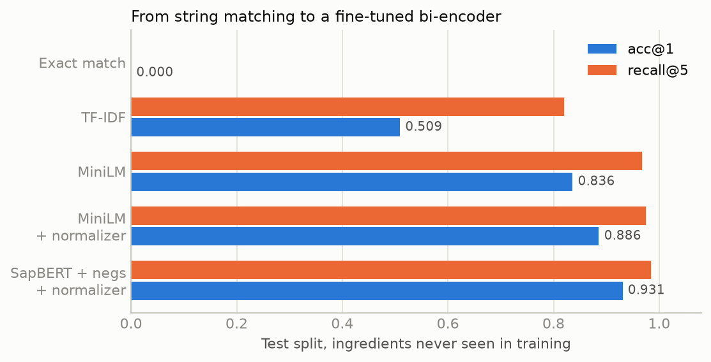
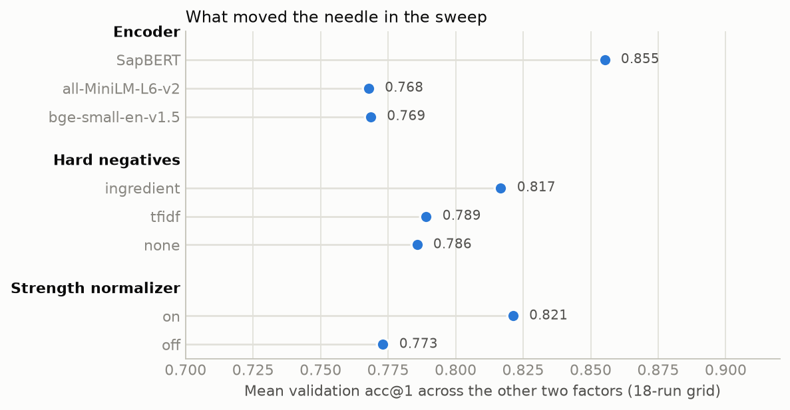
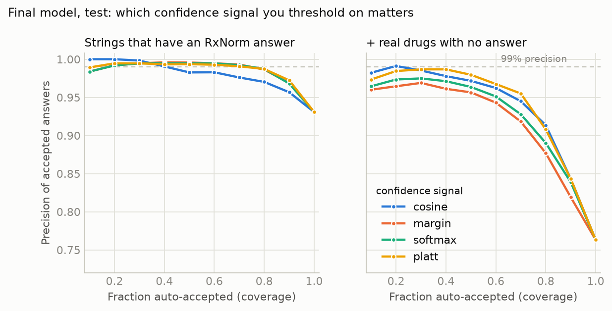
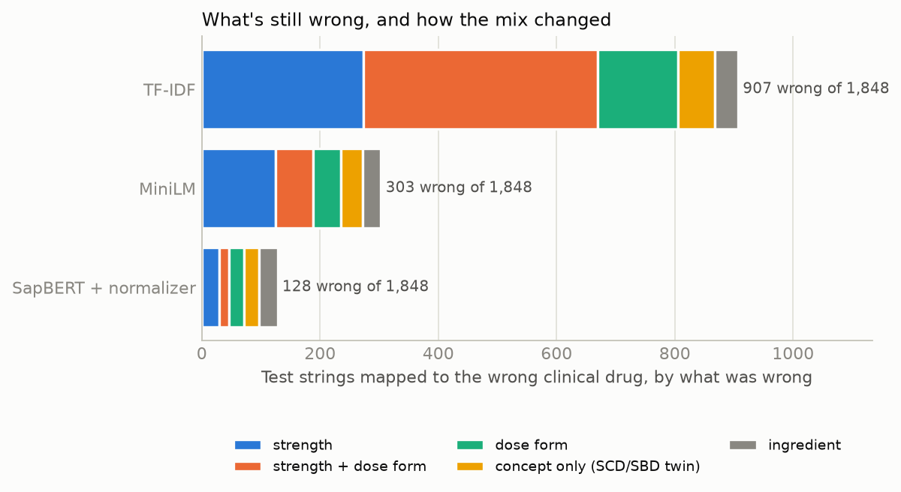
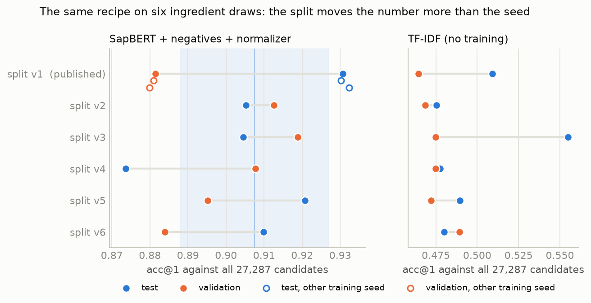
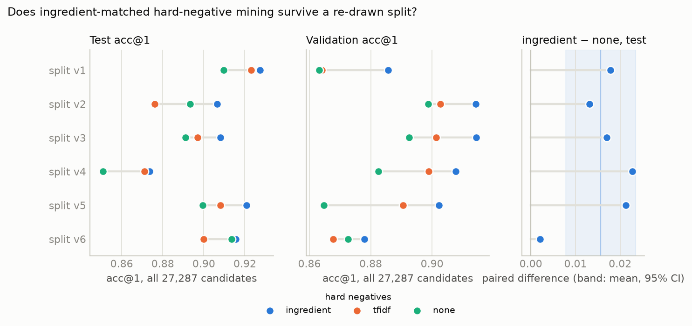

# Mapping VA Drug Names to RxNorm Clinical Drugs with a Fine-Tuned Bi-Encoder

| created | modified | status | confidence | importance |
|---|---|---|---|---|
| 2026-09-11 | 2026-09-15 | finished | likely[^conf] | 4 |

> **Abstract.** Medication normalization tools reliably map a raw drug string to its RxNorm *ingredient* (RxMap, [Korpela et al 2026](#references), reports F1 ≈ 0.97), but the code a pharmacy or interaction checker needs is the *clinical drug*: ingredient, strength, and dose form resolved together. I ask how far a small retrieval model gets at that level, using a labeled dataset that costs nothing to build: the VA National Drug File (VANDF) is a source vocabulary inside RxNorm, so every VA name that shares a concept identifier with an RxNorm clinical drug is, by NLM's own curation, the same drug. From the 2026-09-08 release I extract 14,372 (VA string, SCD/SBD) pairs over 8,315 targets and a 27,287-candidate pool, split *by ingredient* so the test set contains only drugs whose ingredients were never seen in training. Exact string match scores 0; TF-IDF character n-grams reach acc@1 0.509; a MiniLM bi-encoder fine-tuned with a contrastive loss and ingredient-matched hard negatives reaches 0.836; a 40-line rule that pre-computes RxNorm-style concentrations adds 5 points (0.886); and an 18-run grid shows domain pre-training (SapBERT) is worth a further +8.6 points of validation accuracy, more than either of the other factors; a second 18-run sweep re-checks the smallest factor on six ingredient draws, and ingredient-matched hard negatives beat in-batch-only on every one of them (+1.6 points test acc@1, 95% CI 0.8–2.4). The final model scores **acc@1 0.931 (95% CI 0.918–0.941), recall@5 0.984** on the published test split; re-drawing the ingredient split five more times and retraining puts the same recipe at **0.907 ± 0.019** (range 0.874–0.931), with the published draw the most favorable of the six and training-seed noise at 0.001. Because a 7% error rate is not deployable without review, I calibrate a confidence score and choose thresholds on validation only: 79% of answerable strings can be auto-accepted at 98.8% precision, or 46% at 98.2% once real drugs with no clinical-drug concept are included. Remaining errors split evenly across strength, dose form, ingredient, and brand-versus-generic twins, and a share of the strength errors are underdetermined by the input string. Limitations: VA strings only; a headline that should be read as a band of about two points rather than a point estimate, because the ingredient draw moves it by two to three times the sampling error; and calibration thresholds fit on one split. Code, data, model, and every run are public.

## 1. Background

### 1.1 Atoms, concepts, and why the labels are free

RxNorm ([Nelson et al 2011](#references)) is the U.S. National Library of Medicine's normalized vocabulary for clinical drugs. Its central design choice, inherited from the UMLS Metathesaurus ([Bodenreider 2004](#references)), is the distinction between an *atom* (one name string from one source vocabulary, with its own RXAUI) and a *concept* (the meaning those atoms share, with an RXCUI). RxNorm carries names from thirteen source vocabularies in the September 2026 release, and NLM editors group every atom that denotes the same drug under one RXCUI. Alongside the source names, NLM writes its own normalized name for each concept at several levels of specificity, identified by term type (TTY):

| TTY | Level | Example |
|---|---|---|
| IN | ingredient | amoxicillin |
| MIN | multiple ingredients | amoxicillin / clavulanate |
| SCDC | ingredient + strength | amoxicillin 250 MG |
| SCDF | ingredient + dose form | amoxicillin Oral Capsule |
| **SCD** | **ingredient + strength + dose form** | **amoxicillin 250 MG Oral Capsule** |
| **SBD** | **SCD + brand** | **amoxicillin 250 MG Oral Capsule [Amoxil]** |
| GPCK / BPCK | pack | Medrol Dose Pack |

One of the source vocabularies is VANDF, the VA National Drug File. A VANDF atom and an RXNORM SCD or SBD atom that share an RXCUI are therefore labeled as the same drug by NLM, and the labeling has been maintained by pharmacists for two decades. That is a supervised dataset sitting in a public download: no annotation, no synthetic corruption, and no protected health information, since the strings are formulary names rather than patient records. Both VANDF and RXNORM carry UMLS source restriction category 0 ("general terms of the License apply with no additional restrictions"), so a derived dataset can be redistributed.[^license]

### 1.2 Ingredient-level normalization is largely solved; clinical-drug level is not

The lineage of medication normalization runs through rule-based extractors that emit RxNorm codes from clinical text, MedEx ([Xu et al 2010](#references)) and MedXN ([Sohn et al 2014](#references)), to the current LLM-assisted RxMap ([Korpela et al 2026](#references)), which reports RXCUI-level precision, recall, and F1 rising from 0.865, 0.853, and 0.859 to 0.969, 0.964, and 0.966, "with similar gains at the ingredient level", on 22,624 unique medication strings from the Medical Expenditure Panel Survey. RxMap's targets are IN/MIN concepts. Told `HYOSCYAMINE SO4 0.125MG/5ML ELIXIR`, it will say *hyoscyamine*, reliably.

What a pharmacy system, an interaction checker, or a research cohort definition needs is `hyoscyamine sulfate 0.025 MG/ML Oral Solution`, RXCUI and all. Reaching it means getting three things right at once, and it involves unit arithmetic (per-5 mL to per-mL), salt conventions (`SO4` → sulfate, and whether the salt appears in the name at all under RxNorm's basis-of-strength rules), and a dose-form vocabulary that shares almost nothing with the VA's (`TAB,SA` → `Extended Release Oral Tablet`). NLM itself notes that a substantial share of source-vocabulary drug names receive no normalized name at all, because they fall outside RxNorm's scope (supplies, nutrition products, packs).[^forty] I could not find a public, trained-model treatment of the clinical-drug level on open data, which is the gap this write-up addresses.

### 1.3 Why retrieval rather than classification

With 8,315 targets among the labeled pairs and about 1.7 VA strings per target, a classifier over 27,287 output classes would see most classes fewer than twice and the held-out classes never. Framing the task as retrieval, embed the query, embed every candidate name, take the nearest, lets the model score targets it has never seen, which is the only setting in which an ingredient-held-out test set makes sense. This is the standard approach in biomedical entity linking ([Sung et al 2020](#references); [Liu et al 2021](#references)) and in dense passage retrieval ([Karpukhin et al 2020](#references)); the contribution here is the dataset construction, the evaluation discipline, and the specific findings about what helps.

## 2. Hypotheses

Stated in the order the experiments were run. H1–H3 were held before any model was trained. H4 was written down after the first model's error analysis and before the normalizer was run, and is the only genuinely pre-registered prediction about an intervention. H5 and H6 are the questions the sweep and calibration were designed to answer; I had no directional prediction for H5 beyond "probably some effect".

- **H1.** Exact string match between VA names and RxNorm names is near zero: the two vocabularies do not agree by accident.
- **H2.** A character n-gram TF-IDF retriever identifies the *ingredient* well but fails on strength and dose form, because those are expressed in different notations on the two sides.
- **H3.** A bi-encoder fine-tuned contrastively with hard negatives drawn from the same ingredient (different strength or dose form) will beat TF-IDF by a large margin on held-out ingredients, and its remaining errors will concentrate on strength.
- **H4.** Strength errors that are unit conversions (`0.25%` → `2.5 MG/ML`) will not be learned from ~9k examples; a deterministic preprocessor that appends the RxNorm-style concentration will remove most of them without affecting ingredient or dose-form accuracy.
- **H5.** Among base encoder, hard-negative strategy, and the normalizer, at least one factor will dominate; I did not predict which.
- **H6.** Raw cosine similarity is a poor confidence signal; a calibrated score (temperature-scaled softmax or a Platt layer) will allow a meaningful fraction of strings to be auto-accepted at ≥98% precision with thresholds chosen on validation, and the useful fraction will drop once strings with no correct answer are included.

## 3. Data

### 3.1 Extraction

From the RxNorm full monthly release of 2026-09-08, loaded into DuckDB (`RXNCONSO` 1,210,458 rows; `RXNREL` 7,480,642; `RXNSAT` 7,747,732):

| | Count |
|---|---|
| Active VANDF atoms (`SUPPRESS = N`) | 53,195 |
| …of term type `CD` (clinical drug name) or `AB` (print name) that land on an SCD/SBD | 17,964 |
| …after merging identical strings that appear as both CD and AB | **14,372 pairs** |
| Distinct SCD/SBD targets among the pairs | 8,315 |
| Active SCD/SBD in all of RxNorm (the retrieval pool) | **27,287** (17,602 SCD + 9,685 SBD) |
| Active VA CD/AB names with no SCD/SBD | **17,564** |

VANDF term types `IN` (ingredients), `PT` (drug classes), and `MTH_RXN_CD` (NLM-generated `_#N` duplicates) are excluded as inputs. Each target is labeled with its ingredients (IN-level, via SCDC `constitutes` and IN `ingredient_of`), strength (SCDC `RXN_STRENGTH`), dose form (DF `dose_form_of`), quantity (`RXN_QUANTITY`, present for about 3k drugs), and brand, so that an error can be attributed to a component. SBDs inherit their generic SCD's ingredients.

Of the 17,564 unmatched names, 16,745 have no RxNorm concept at all (catheters, tube feeds, nutrition). The remaining 819 are real drugs that RxNorm knows only outside the target space: 407 generic and 244 branded packs, 67 SCDG, 51 SCDF, and 50 ingredient-only concepts. For these, *every* retrieved answer is wrong, and they are the hard abstention cases in §5.6.

### 3.2 Split by ingredient

A random split would put `metoprolol 25 MG` in training and `metoprolol 50 MG` in test, and a model could pass by matching on "metoprolol". Instead every IN RXCUI is hashed (md5 with a fixed salt, stable across DuckDB versions) into train/val/test at 70/15/15, and a target follows its ingredients. Combination drugs whose ingredients fall in different splits are labeled `mixed` and excluded from all three, since training on one would leak a test ingredient. Hard negatives during training are drawn only from train-split candidates; evaluation, by contrast, always searches all 27,287, because that is what a deployed mapper faces.

| Split | Pairs | Candidates | Unmatched |
|---|---|---|---|
| train | 9,290 | 17,163 | – |
| val | 1,907 | 3,641 | 8,786 |
| test | 1,848 | 3,180 | 8,778 |
| mixed (excluded) | 1,327 | 3,303 | – |

Two VA strings map to more than one concept (an albuterol inhaler with three NDA-specific SCDs; a thyroid tablet at 30 and 32 MG); a prediction of any of them counts as correct.

### 3.3 Precision of the estimates

With n = 1,848 test strings, a Wilson 95% interval ([Wilson 1927](#references)) at 93% accuracy is about ±1.2 points; at 51% it is ±2.3. Those intervals describe sampling error *given this split*. They do not capture the variance from which ingredients landed where, and §5.8 measures that source directly: across six draws of the split the final model's test acc@1 has a standard deviation of 0.019, about 2.5 times the 0.007 that sampling alone predicts. On this split, validation (n = 1,907) is harder than test for every method tried, by 4 to 6 points; §5.8 shows that ordering is a property of the draw, not of the task, and flips on half of the re-draws. I report both throughout.

### 3.4 What the hard cases look like

Random samples from the pairs, before any modeling, illustrate why this is not a spelling problem:

| VA string | RxNorm target | Difficulty |
|---|---|---|
| `HYOSCYAMINE SO4 0.125MG/5ML ELIXIR` | `hyoscyamine sulfate 0.025 MG/ML Oral Solution` | unit arithmetic; `SO4` → sulfate; elixir → oral solution |
| `POVIDONE 0.5% OPH GEL` | `povidone 0.005 MG/MG Ophthalmic Gel` | percent → mass ratio (RxNorm uses MG/MG for semisolids) |
| `MANNITOL 250MG/ML INJ` | `50 ML mannitol 250 MG/ML Injection` | the 50 ML appears nowhere in the input |
| `ISOSORBIDE MONONITRATE 120MG SA TAB` | `24 HR isosorbide mononitrate 120 MG Extended Release Oral Tablet` | `SA` → `24 HR … Extended Release` |
| `PANCREAZE 16,800UNIT EC CAP` | `amylase 98400 UNT / lipase 16800 UNT / protease 56800 UNT Delayed Release Oral Capsule` | brand → three ingredients, two of which are not in the string |
| `ESTRADIOL 0.0375MG/DAY (EQV-VIVELLE-DOT)` | `84 HR estradiol 0.00156 MG/HR Transdermal System` | per-day → per-hour, and a wear time the string never states |
| `DOXEPIN HCL 10MG CAP` vs `METOPROLOL TARTRATE 12.5MG TAB` | `doxepin 10 MG …` vs `metoprolol tartrate 12.5 MG …` | the salt is dropped in one name and kept in the other |

The mannitol and estradiol rows are *underdetermined*: no model can read the missing quantity from the string. The right behavior there is to abstain, which is why calibration is part of the method rather than an afterthought.

## 4. Method

### 4.1 Baselines

*Exact match* lowercases both sides and strips punctuation. *TF-IDF* uses character 3-to-5-grams with cosine similarity over all 27,287 candidates; it is what one would build in an afternoon and it is the floor every model has to clear. Both are scored by the same evaluation code as the trained models (`rxnorm_vandf/eval.py`), because a comparison across different scorers is not a comparison.

### 4.2 Bi-encoder with contrastive fine-tuning

The model is a sentence-transformers bi-encoder ([Reimers & Gurevych 2019](#references)): one encoder maps a string to a unit vector, and the answer is the candidate with the highest cosine. Training uses [`MultipleNegativesRankingLoss`](https://github.com/UKPLab/sentence-transformers/blob/v4.1.0/sentence_transformers/losses/MultipleNegativesRankingLoss.py), the in-batch softmax loss of [Henderson et al 2017](#references): for a batch of 64 (anchor, positive, hard negative) triplets, each anchor is scored against 128 names, and the loss is cross-entropy with its own positive as the target. The *hard negative* in each triplet is a train-split product with the same ingredients and a different strength or dose form, which is exactly the confusion TF-IDF exhibits (H2). A `NO_DUPLICATES` sampler prevents two VA strings for the same product from landing in one batch and being told each other's positive is wrong. Hard negatives of this kind are the standard remedy for retrievers that find the topic but not the item ([Karpukhin et al 2020](#references)).

Three base encoders were compared: [`all-MiniLM-L6-v2`](https://huggingface.co/sentence-transformers/all-MiniLM-L6-v2) (22M parameters, distilled by [Wang et al 2020](#references) and further trained on about a billion sentence pairs), [`bge-small-en-v1.5`](https://huggingface.co/BAAI/bge-small-en-v1.5) (33M, [Xiao et al 2023](#references)), and [`SapBERT-from-PubMedBERT-fulltext`](https://huggingface.co/cambridgeltl/SapBERT-from-PubMedBERT-fulltext) (110M, [Liu et al 2021](#references)), which was pre-trained to pull UMLS synonyms together and so arrives knowing that `HCL` and `hydrochloride` name the same thing.

Fixed hyper-parameters for every run: 4 epochs, batch 64, learning rate 2e-5 with 10% warm-up and linear decay, max sequence length 96, fp16, seed 42. Validation is scored after every epoch against the full pool; the best epoch by `val/acc@1` is kept; test is scored once with that checkpoint. Test never influences a choice.[^first]

### 4.3 The strength normalizer

A deterministic preprocessor (`rxnorm_vandf/strength.py`) parses per-volume and percent strengths in the VA string and *appends* the RxNorm-style concentration, leaving the original text intact:

| VA form | Appended |
|---|---|
| `0.125MG/5ML` | `0.025 mg/ml` |
| `0.25%` (solution) | `2.5 mg/ml` |
| `0.5%` (gel, ointment, cream) | `0.005 mg/mg` |

Appending rather than replacing means a bad rule cannot destroy the input, and the model keeps whatever it learned from the raw notation. Candidate names are untouched.

### 4.4 Confidence, calibration, and abstention

A cosine of 0.84 does not mean "84% likely to be right". I compare four signals: the raw top-1 cosine; the *margin* between the top two candidates; a temperature-scaled softmax over the top 20 ([Guo et al 2017](#references)), with the single temperature fit by maximum likelihood on validation; and a logistic (Platt, [Platt 1999](#references)) layer over [cosine, margin, log-softmax], trained on validation to predict "was this right?". The Platt layer is fit on validation strings that have an answer *plus* the hard unmatched validation strings, so it also sees what "there is no right answer" looks like. Calibration quality is reported as expected calibration error ([Naeini et al 2015](#references)) and AUROC.

Abstention follows the classic reject-option framing ([Chow 1970](#references)): on validation, find the lowest confidence at which everything above it is ≥ 99% precise (and separately ≥ 95%); apply that fixed threshold to test; report the fraction accepted and the precision *actually achieved*. If test lands at 98.2% when the target was 99%, that gap is information about how stable the threshold is, and I report the achieved number as the estimate. Three populations are evaluated, because which strings count changes the answer:

| Population | Contents |
|---|---|
| matched | test VA strings that have an SCD/SBD (n = 1,848) |
| +hard | plus test VA names that are real drugs with *no* SCD/SBD, where every answer is wrong (n = 2,254) |
| +all | plus supplies, devices, and nutrition products (the whole file; ~80% has no answer) |

### 4.5 The sweep

A full grid over encoder (3) × hard-negative strategy (ingredient-matched, TF-IDF-mined top wrong hit, none) × normalizer (on, off) = 18 runs, one seed each, coordinated as a W&B sweep on a Colab A100. Selection metric is `val/acc@1`; test is shown for reference. The winner was retrained once locally with an artifact logged, then calibrated. The sweep runs themselves do not log models. After §5.8 showed how much a split moves the number, a second sweep (`sweeps/negatives_by_split.yaml`) re-ran the one factor whose effect was inside that noise: SapBERT × negatives (3) × normalizer on × splits v1–v6 = 18 runs on one Colab A100, so every comparison is paired within a split.

## 5. Results

### 5.1 Baselines (H1, H2)

| Baseline | Split | acc@1 | recall@5 | ingredient | strength | dose form | precision@50% | coverage@99% |
|---|---|---|---|---|---|---|---|---|
| exact | test | 0.000 | 0.000 | – | – | – | – | – |
| TF-IDF | val | 0.465 | 0.727 | 0.945 | 0.574 | 0.679 | 0.622 | 0.001 |
| TF-IDF | test | 0.509 | 0.820 | 0.978 | 0.617 | 0.698 | 0.601 | 0.004 |

Exact match is zero: not one of 14,372 VA strings equals its RxNorm name after lowercasing and punctuation stripping (H1 confirmed, more absolutely than expected). TF-IDF finds the drug but not the product (H2 confirmed): the ingredient of its top hit is right 97.8% of the time, the strength 61.7%, the dose form 69.8%. Of its 907 test failures, 396 are wrong on both strength and dose form, 273 on strength only, 136 on dose form only, 62 have every component right but the wrong concept (an SCD and its SBD, or NDA-distinguished twins), and 40 have the wrong ingredient. Recall@5 at 0.820 against acc@1 at 0.509 says the right answer is usually nearby and the baseline cannot rank it first. It also has a length bias: `abatacept 250 MG Injection` outscores the correct `1 ML abatacept 125 MG/ML Auto-Injector` for four different VA abatacept strings, because a short name shares a larger fraction of its n-grams with anything. Its cosine is a useless confidence: the fraction of the file that can be accepted at 99% precision is 0.4%.

### 5.2 First fine-tune: MiniLM with ingredient-matched negatives (H3)

Run `all-minilm-l6-v2-ingredient` ([W&B](https://wandb.ai/kettle-labs/rxnorm-vandf/runs/fked1jx1)), local GTX 1070, 4 epochs × 145 steps, 4.8 minutes. 123 of the 9,287 training rows fell back to a TF-IDF negative because their ingredient had only one product.

| | test acc@1 | recall@5 | ingredient | strength | dose form | val acc@1 |
|---|---|---|---|---|---|---|
| TF-IDF | 0.509 | 0.820 | 0.978 | 0.617 | 0.698 | 0.465 |
| **MiniLM, fine-tuned** | **0.836** | **0.967** | 0.983 | 0.884 | 0.935 | 0.773 |

Validation acc@1 by epoch: 0.734 → 0.772 → **0.774** → 0.772 (epoch 3 kept). Training loss fell from 1.9 to 0.14. Dose-form accuracy jumped from 70% to 94%: the model learned that `TAB,SA` means `Extended Release Oral Tablet` and `SOLN,IRRG` means `Irrigation Solution`. Strength went only from 62% to 88%, and strength now accounts for 62% of what remains (H3 confirmed on both counts). Of 303 test failures: 125 strength only, 63 strength and dose form, 47 dose form only, 37 wrong concept with all components right, 31 wrong ingredient.

The strength failures had a specific shape:

- `ACETIC ACID 0.25% IRRG SOLN` → predicted `acetic acid 30 MG/ML`, truth `2.5 MG/ML`
- `ACETYLCYSTEINE 10% INHL SOLN` → predicted `200 MG/ML`, truth `100 MG/ML`

Converting a percentage to milligrams per millilitre is arithmetic. An embedding model has seen `0.25%` near `2.5 MG/ML` some hundreds of times and learned a fuzzy association, not a rule. That observation is what produced H4.

**Replication.** The identical configuration and seed run in Colab on an A100 (run `0eaijnrv`) gave test 0.839 / 0.969 against 0.836 / 0.967 locally, val 0.774 / 0.932 against 0.773 / 0.927, and chose epoch 4 rather than 3 (val 0.775 vs 0.774, a coin flip). Differences of 3–6 strings in 1,848 are GPU and library nondeterminism; I treat ±0.5 point as the same run. The A100 trained in 91 s against 304 s on the 1070.

### 5.3 The strength normalizer (H4)

Run `all-minilm-l6-v2-ingredient-strength` ([W&B](https://wandb.ai/kettle-labs/rxnorm-vandf/runs/x9p04t9i)): same model, seed, and data, one flag.

| | test acc@1 | recall@5 | ingredient | strength | dose form | val acc@1 |
|---|---|---|---|---|---|---|
| MiniLM | 0.836 | 0.967 | 0.983 | 0.884 | 0.935 | 0.773 |
| **MiniLM + normalizer** | **0.886** | **0.975** | 0.982 | **0.941** | 0.943 | **0.829** |

+5.0 points on test and +5.6 on validation. Strength errors roughly halved (11.6% → 5.9%); ingredient and dose form did not move, which is what a rule that touches only strength should do. Validation by epoch (0.799 → 0.824 → 0.828 → 0.826) has the same plateau shape, shifted up. H4 is confirmed in both its parts. It was the largest single gain per hour of work in the project.



*Figure 1. Test acc@1 and recall@5 for each method, n = 1,848 held-out-ingredient strings. Data: `figures/data.json`.*

### 5.4 The sweep (H5)

Sweep `idhaaw5i` ([W&B](https://wandb.ai/kettle-labs/rxnorm-vandf/sweeps/idhaaw5i)), 18 runs, Colab A100, about 30 minutes in total. Sorted by the selection metric.

| Encoder | Negatives | Normalizer | val acc@1 | test acc@1 | test recall@5 | test strength acc |
|---|---|---|---|---|---|---|
| **SapBERT** | **ingredient** | **on** | **0.886** | **0.927** | 0.984 | 0.965 |
| SapBERT | tfidf | on | 0.864 | 0.923 | 0.984 | 0.967 |
| SapBERT | none | on | 0.863 | 0.910 | 0.990 | 0.970 |
| SapBERT | ingredient | off | 0.846 | 0.911 | 0.983 | 0.943 |
| SapBERT | none | off | 0.836 | 0.893 | 0.986 | 0.951 |
| SapBERT | tfidf | off | 0.835 | 0.905 | 0.981 | 0.950 |
| MiniLM | ingredient | on | 0.831 | 0.890 | 0.977 | 0.941 |
| bge-small | ingredient | on | 0.812 | 0.872 | 0.979 | 0.939 |
| bge-small | tfidf | on | 0.795 | 0.848 | 0.981 | 0.936 |
| bge-small | none | on | 0.791 | 0.864 | 0.981 | 0.938 |
| MiniLM | none | on | 0.776 | 0.861 | 0.975 | 0.931 |
| MiniLM | ingredient | off | 0.775 | 0.839 | 0.969 | 0.884 |
| MiniLM | tfidf | on | 0.773 | 0.861 | 0.979 | 0.932 |
| bge-small | ingredient | off | 0.751 | 0.817 | 0.962 | 0.870 |
| bge-small | tfidf | off | 0.737 | 0.784 | 0.966 | 0.856 |
| MiniLM | tfidf | off | 0.730 | 0.802 | 0.966 | 0.861 |
| bge-small | none | off | 0.725 | 0.773 | 0.957 | 0.838 |
| MiniLM | none | off | 0.723 | 0.804 | 0.957 | 0.861 |

Mean validation acc@1 by factor level:

| Factor | Levels | Effect |
|---|---|---|
| Encoder | SapBERT 0.855 · bge-small 0.769 · MiniLM 0.768 | **+8.6 points** for domain pre-training; the two general-English encoders tie to the third decimal |
| Strength normalizer | on 0.821 · off 0.773 | **+4.8 points**, positive in all 9 encoder × negatives pairs |
| Hard negatives | ingredient 0.817 · tfidf 0.789 · none 0.786 | **+3.0 points** for ingredient-matched; TF-IDF-mined negatives are no better than in-batch only |



*Figure 2. Mean validation acc@1 per factor level across the 18-run grid. Data: `figures/data.json`.*

The effects are roughly additive, and the best cell is best on every axis, so there is no interesting interaction to report. On H5: the encoder dominates, and the direction is instructive. `bge-small` is newer and scores higher than MiniLM on general retrieval benchmarks, yet the two are indistinguishable here; SapBERT, which is older and not a general-purpose embedder at all, wins by a wide margin because its pre-training objective (UMLS synonym alignment) is almost this task. Two cautions. Each cell is one seed on one split. §5.8 puts training-seed noise at 0.001 on the same hardware (the ±0.5 point in §5.2 was the GPU and library stack), but the split itself moves test acc@1 by about 0.02 between draws; the encoder effect is far outside that, the normalizer effect comfortably so, and the +3.0 negatives effect is not, which is why §5.9 re-runs it on every split. And the normalizer's contribution shrinks with SapBERT (+4.0 on its best cell vs +5.6 for MiniLM), consistent with a stronger encoder having absorbed some of the conversions.

### 5.5 Final model

The winning configuration retrained locally with an artifact (run `sapbert-ingredient-strength-final`, [W&B](https://wandb.ai/kettle-labs/rxnorm-vandf/runs/0d9ntjls); 19.5 minutes on the GTX 1070; artifact `vandf-rxnorm-biencoder:v3`). Validation 0.883 / 0.961 against the sweep cell's 0.886, within noise.

| | acc@1 | 95% CI | recall@5 | ingredient | strength | dose form |
|---|---|---|---|---|---|---|
| exact match | 0.000 | 0.000–0.002 | 0.000 | – | – | – |
| TF-IDF | 0.509 | 0.486–0.532 | 0.820 | 0.978 | 0.617 | 0.698 |
| MiniLM | 0.836 | 0.818–0.852 | 0.967 | 0.983 | 0.884 | 0.935 |
| MiniLM + normalizer | 0.886 | 0.871–0.900 | 0.975 | 0.982 | 0.941 | 0.943 |
| **SapBERT + ingredient negatives + normalizer** | **0.931** | **0.918–0.941** | **0.984** | 0.983 | 0.961 | 0.972 |

Test, n = 1,848 held-out-ingredient strings; Wilson intervals. Validation acc@1 for the final model is 0.883 (0.868–0.897, n = 1,907). The Wilson interval is the sampling error on this draw; §5.8 shows the draw itself is the larger source, and that 0.931 is the top of a six-split range whose mean is 0.907. The public inference wrapper (`rxnorm_vandf.infer.Mapper`) reproduces 0.931 through the published code path.

### 5.6 Calibration and abstention (H6)

Temperature 0.042; thresholds chosen on validation, measured on test.

| Population | Signal | AUROC | ECE | accepted @95% target (precision) | accepted @99% target (precision) |
|---|---|---|---|---|---|
| matched | cosine | 0.834 | – | 87.0% (0.962) | 33.3% (0.997) |
| matched | **softmax** | 0.905 | 0.026 | 94.5% (0.956) | **79.0% (0.988)** |
| +hard | margin | 0.867 | – | 55.7% (0.954) | 0.5% (0.636) |
| +hard | **platt** | 0.933 | 0.035 | 70.5% (0.954) | **46.0% (0.982)** |
| +all | platt | 0.991 | 0.030 | 12.1% (0.938) | 0.2% (0.842) |



*Figure 3. Precision of the accepted set as a function of the fraction accepted, for each signal, on the matched (left) and +hard (right) test populations. Data: `figures/data.json`.*

On strings that have an answer, the softmax signal lets 79.0% of the file be accepted automatically at 98.8% precision (Wilson 95% CI 0.981–0.992 over the 1,460 accepted). The remaining 21% goes to a reviewer with the top five, where the right answer sits 98.4% of the time. Raw cosine manages 33%.

The right-hand panel is the part I would have missed had I not kept the unanswerable names. Once real drugs that RxNorm knows only as a pack or an ingredient are included, *margin* collapses to 0.5% coverage at 64% precision: for a dose pack, SapBERT retrieves one clear, confident, wrong winner, so the gap to second place says nothing. Only the Platt layer, which also sees the raw cosine ("this does not look like anything"), survives, at 46.0% accepted and 98.2% precision (CI 0.972–0.988 over 1,037). On the whole-file population the 99% threshold is degenerate (0.2% coverage): the validation-chosen cutoff sits above almost everything, and the useful operating point there is the 95% target or lower. Supplies are rejected at about 0.02 confidence regardless.

Two things H6 did not anticipate. First, the 99% validation target landed at 98.2–98.8% on test on every model I calibrated; the threshold transfers imperfectly, and the achieved number is the estimate. Second, calibration is decent but uneven: on +hard, the 0.9–1.0 confidence bin is 97.2% accurate and holds 1,239 of 2,254 strings, but the 0.5–0.7 bins are over-confident (for the previous model, a stated 0.56 was right 41% of the time), and that is where the accepted errors come from. The default threshold shipped with the model (0.922, the +hard 99% cutoff) accepts 55.5% of matched test strings at 99.2% precision.

### 5.7 What is still wrong



*Figure 4. Test failures by component, for TF-IDF (907), MiniLM (303), and the final model (128). Data: `figures/data.json`.*

| Category | TF-IDF | MiniLM | Final |
|---|---|---|---|
| strength only | 273 | 125 | 29 |
| strength and dose form | 396 | 63 | 17 |
| dose form only | 136 | 47 | 26 |
| ingredient | 40 | 31 | 31 |
| all components right, wrong concept | 62 | 37 | 25 |
| **total** | **907** | **303** | **128** |

TF-IDF's errors were three-quarters strength. The final model's are an even spread: 46 involve strength, 43 dose form, 31 ingredient, and 25 are cases where every component is right but the concept is not, almost always a branded product and its generic with names identical apart from the brand. Ingredient errors did not move between MiniLM and the final model (31 and 31), and top-1 ingredient accuracy is 0.983 for both; whatever is left there is not a matter of encoder. A good share of the strength errors are the underdetermined strings of §3.4: `MANNITOL 250MG/ML INJ` maps to `50 ML mannitol 250 MG/ML Injection` and the volume is not in the input. No model reads that from the string; the right behavior is to abstain, and the calibrated confidence mostly does.

### 5.8 Split and seed variance

Every number above comes from one ingredient hash and one training seed. To measure what that hides, I re-drew the split with five more salts (v2–v6; same 70/15/15 rule by ingredient, same `mixed` exclusion) and retrained the final configuration on each with seed 42, then repeated the published split (v1) with training seeds 1 and 2. Eight runs on the GTX 1070, about 20 minutes each, W&B group `split-seeds`, no model artifacts. The v1 × seed 42 run reproduced the published run to the third decimal (0.931 / 0.984), which is the pipeline check. TF-IDF was scored on the same six splits as a model-free measure of how hard each draw is. Because the split is by ingredient and a few ingredients carry dozens of products, the draws differ in size by hundreds of pairs.

| Split | Pairs train / val / test / mixed | val acc@1 | test acc@1 | val − test | test recall@5 | TF-IDF test acc@1 |
|---|---|---|---|---|---|---|
| v1 (published) | 9,290 / 1,907 / 1,848 / 1,327 | 0.881 | **0.931** | −0.049 | 0.984 | 0.509 |
| v2 | 9,562 / 1,808 / 1,752 / 1,250 | 0.913 | 0.905 | +0.007 | 0.974 | 0.475 |
| v3 | 9,687 / 1,824 / 1,707 / 1,154 | 0.919 | 0.905 | +0.014 | 0.979 | 0.555 |
| v4 | 9,084 / 1,592 / 2,373 / 1,323 | 0.908 | 0.874 | +0.034 | 0.981 | 0.477 |
| v5 | 9,213 / 1,945 / 1,742 / 1,472 | 0.895 | 0.921 | −0.026 | 0.985 | 0.490 |
| v6 | 9,446 / 1,674 / 1,908 / 1,344 | 0.884 | 0.910 | −0.026 | 0.988 | 0.480 |
| **mean ± sd (6 splits)** | | 0.900 ± 0.015 | **0.907 ± 0.019** | −0.007 ± 0.031 | 0.982 ± 0.005 | 0.498 ± 0.031 |
| v1, seed 1 | as v1 | 0.881 | 0.930 | −0.049 | 0.984 | – |
| v1, seed 2 | as v1 | 0.880 | 0.932 | −0.052 | 0.984 | – |



*Figure 5. The final recipe on six ingredient draws (left) and TF-IDF on the same draws (right). Filled markers are seed 42; hollow markers on the v1 row are seeds 1 and 2. The band is the mean ± sd of test acc@1 over the six splits. Data: `figures/data.json`; runs in W&B group `split-seeds`.*

Four things follow.

- **The split is the dominant noise, and the published draw is a favorable one.** Test acc@1 over six draws is 0.907 ± 0.019, range 0.874–0.931, and v1 is the best of the six. Binomial sampling at n ≈ 1,850 predicts a spread of 0.007; the remaining 0.018 is the ingredient draw itself. A standard deviation estimated from six draws is only known to within a factor of about 0.6 to 2.5, so the honest statement is "about two points", not 0.019. The headline for this recipe is 0.91 ± 0.02 on unseen ingredients, and the 0.931 in §5.5 should be read as the top of that band.
- **The training seed does not matter.** Seeds 1, 2, and 42 on the published split give 0.930, 0.931, and 0.932 on test and 0.880–0.881 on validation. The half-point difference between the local and Colab replications in §5.2 was the hardware and library stack, not the seed.
- **"Validation is the harder draw" was an accident of v1.** The val − test gap runs −0.049, +0.007, +0.014, +0.034, −0.026, −0.026 across the six splits: mean −0.007, standard deviation 0.031, sign split three to three. §3.3's observation that every method scored lower on validation than on test described this split, not the task. It also means the per-epoch model selection on validation was selecting on a harder set than it was reporting on, which is the conservative direction.
- **What does not move.** Recall@5 stays within 0.974–0.988, ingredient accuracy within 0.980–0.994, strength within 0.951–0.967, and dose form within 0.954–0.974 across all six draws. The operational claims in §6.3 rest on recall@5 and on calibration; recall@5 is the stable quantity. Calibration was not re-run per split, so the thresholds in §5.6 remain a v1 result.

TF-IDF's difficulty ordering is not the model's: its split-to-split standard deviation is 0.031, and its test accuracy correlates only weakly with SapBERT's across the six draws (r = 0.23; v3 is TF-IDF's easiest split and the model's joint hardest). What is hard for a string matcher (unusual notation) and what is hard for the fine-tuned model (product-rich ingredient families full of twins) are different things. The hardest draw for the model, v4, also happens to be the largest test set, 2,373 pairs, which is what a by-ingredient split does when a few product-rich ingredients land in test.

The sweep's factor effects (§5.4) were measured on v1 only. The encoder (+8.6) and normalizer (+4.8) effects are several times the two-point split noise; the hard-negatives effect (+3.0) is about one and a half times it. §5.9 settles that one.

### 5.9 Hard negatives across splits

Sweep `uukeyzw7` ([W&B](https://wandb.ai/kettle-labs/rxnorm-vandf/sweeps/uukeyzw7)): SapBERT with the normalizer on, the three hard-negative strategies, on each of the six splits, 18 runs on one Colab A100 in about 35 minutes. The three v1 cells reproduced the original sweep's v1 cells to four decimals (0.9275 / 0.9232 / 0.9096 test), which says two things: the pipeline is unchanged, and Colab's stack is bit-reproducible on the same GPU type, so the half-point difference in §5.2 was the 1070 against the A100 and nothing else.

| Split | ingredient, test (val) | tfidf, test (val) | none, test (val) | ingredient − none, test | ingredient − none, val |
|---|---|---|---|---|---|
| v1 | 0.927 (0.886) | 0.923 (0.864) | 0.910 (0.863) | +0.018 | +0.023 |
| v2 | 0.906 (0.914) | 0.876 (0.903) | 0.893 (0.899) | +0.013 | +0.015 |
| v3 | 0.908 (0.914) | 0.897 (0.901) | 0.891 (0.893) | +0.017 | +0.022 |
| v4 | 0.874 (0.908) | 0.871 (0.899) | 0.851 (0.883) | +0.023 | +0.025 |
| v5 | 0.921 (0.902) | 0.908 (0.890) | 0.900 (0.865) | +0.021 | +0.038 |
| v6 | 0.916 (0.878) | 0.900 (0.868) | 0.914 (0.873) | +0.002 | +0.005 |

| Contrast (paired within split, n = 6) | test acc@1, mean | sd | 95% CI | splits with + sign | val acc@1, mean | 95% CI |
|---|---|---|---|---|---|---|
| **ingredient − none** | **+0.016** | 0.007 | +0.008 to +0.024 | **6 / 6** | +0.021 | +0.010 to +0.033 |
| ingredient − tfidf | +0.013 | 0.010 | +0.002 to +0.023 | 6 / 6 | +0.013 | +0.008 to +0.018 |
| tfidf − none | +0.003 | 0.015 | −0.013 to +0.019 | 4 / 6 | +0.008 | −0.003 to +0.020 |



*Figure 6. Test (left) and validation (centre) acc@1 for the three hard-negative strategies on each split, and the paired ingredient − none difference on test (right) with its mean and 95% interval. Data: `figures/data.json`; runs in sweep `uukeyzw7`.*

The effect survives. Ingredient-matched negatives beat in-batch-only on all six splits, by 1.6 points of test acc@1 on average, with the smallest win (v6, +0.002) still positive; with six pairs, six of six is the only sign count that reaches p < 0.05, and the paired interval excludes zero on both test and validation. The original +3.0 in §5.4 was a validation number averaged over all encoders; on SapBERT alone and paired by split it is +2.1 on validation and +1.6 on test, so the single-split sweep overstated it by about a third but had the sign and the ranking right. TF-IDF-mined negatives are not distinguishable from in-batch only (+0.003, sign split four to two), which is what §5.4 found and now holds across draws. Recall@5 does not depend on the strategy at all (−0.002 ± 0.004): the negatives sharpen the top-1 choice among candidates the model already retrieves. The two factors that were not re-run, encoder and normalizer, have single-split effects several times the split noise and are left as measured.

## 6. Discussion

### 6.1 Verdicts

| | Prediction | Outcome |
|---|---|---|
| H1 | exact match near zero | zero of 14,372 |
| H2 | TF-IDF gets ingredient, misses strength and form | 0.978 / 0.617 / 0.698 |
| H3 | contrastive fine-tune beats TF-IDF by a wide margin; strength dominates residual | +32.7 points; 62% of residual errors involve strength |
| H4 | deterministic normalizer removes most conversion errors, leaves other components alone | strength errors halved; ingredient and form unchanged |
| H5 | one factor dominates | encoder, +8.6, nearly twice the normalizer and nearly three times negatives |
| H6 | calibrated score allows meaningful auto-acceptance; drops with unanswerable strings | 79% at 98.8%; 46% at 98.2% |

None of the hypotheses concerned the split, and the experiment that tested it (§5.8) changed the headline more than any of them: the same recipe scores 0.874 to 0.931 depending on which ingredients are held out. The one sweep factor small enough to be at risk from that, hard negatives, held on all six draws (§5.9). The one conclusion I would carry to another project is H4's: when a model's failures are deterministic, write the rule and let the model do what it is good at, which is matching strings. The second is H5's: a domain-aligned pre-training objective mattered more than parameter count or benchmark recency, and it is cheap to check, since SapBERT trains in two minutes on a Colab A100.

### 6.2 Threats to validity

- **Six splits, not sixty.** The final recipe (§5.8) and the hard-negatives factor (§5.9) were run on six ingredient draws; the baselines, the encoder and normalizer factors, and the calibration were run on one. Six draws pin the split standard deviation to a factor of about two, so "0.907 ± 0.019" is a band, not a measurement of the band's width. The two factors not re-run have single-split effects of +8.6 and +4.8, several times that band. Training-seed noise is measured and negligible.
- **VA strings only.** Training and evaluation are on one institution's naming conventions. Another hospital's formulary is a different distribution, and generalization to it is unmeasured. The held-out-ingredient split guards against memorizing drugs, not against memorizing the VA's abbreviation habits.
- **Not comparable to RxMap.** RxMap's numbers are on MEPS strings at the ingredient level; mine are on VA strings at the clinical-drug level. The framing in §1.2 is that these are different tasks, not that one system beats the other.
- **Threshold transfer.** The 99% target reached 98.2–98.8% on test. Anyone deploying a threshold should re-choose it on their own held-out data and expect a similar shortfall.
- **Labels assumed clean.** NLM's linking is the ground truth. Only two strings are multiply labeled, which suggests noise is low, but a VANDF atom linked to the wrong SCD would be scored as a model error.
- **The hard-unmatched set is small.** 819 real drugs without an SCD/SBD, of which 406 are in test. The +hard results rest on those.

### 6.3 What this supports operationally

- As a **suggestion tool** for a human mapper: yes. Top-five recall of 97.4–98.8% across six splits means the reviewer almost never searches RxNorm by hand.
- As an **auto-mapper with review**: a policy decision, not a technical one. Between roughly half and three-quarters of a VA-style file can be accepted at about 98% precision, depending on how much of the file has no answer. Whether 2% wrong is acceptable depends on what is downstream.
- **Fully automatic**: no.

### 6.4 Cost

The first model trains in 5 minutes on a 2016 consumer GPU and 91 seconds on a Colab A100; the final model in 20 minutes locally or about 2 on the A100; the whole 18-run grid in about 30 minutes of A100 time, and the second 18-run sweep of §5.9 about 35 minutes more. Data preparation is seconds. The expensive input was the RxNorm data model, not compute.

## 7. Further work

1. The calibration on a second split, and a k-fold by ingredient for the final recipe, to tighten the two-point band in §5.8 and to see whether the abstention thresholds transfer across draws as well as the accuracy does.
2. The 1,327 `mixed` combination-drug pairs as a "partially seen ingredients" evaluation.
3. Auxiliary ingredient / strength / dose-form heads. Deferred because the taxonomy already comes from the retrieved candidate's labels; they might still help as a training signal.
4. Cross-institution transfer: fine-tune on VA, evaluate on another source vocabulary's names that share RXCUIs (the same trick that built this dataset works for any RxNorm source).
5. A better operating point for the whole-file population, where the 99% threshold is degenerate.

Items 1, 3, and 4 are evaluated in a follow-up report, [Part II](../post-2/README.md). Seven-fold cross-validation by ingredient gives this recipe a pooled out-of-fold acc@1 of 0.894 (Wilson 95% 0.889–0.899), and a 99%-precision threshold chosen on six folds achieves between 98.6% and 99.8% on the seventh. An auxiliary strength head does not change strength accuracy and lowers acc@1 by about 0.001. The final model maps FDA label names (MTHSPL) at acc@1 0.709; training on those names raises this to 0.833 and leaves accuracy on VA names unchanged. Part II also revises two statements in §5.8 and §5.9: over twelve draw-and-seed pairs on the A100, the training seed contributes a standard deviation of 0.0045 in test acc@1 rather than 0.001, and runs repeated at the same seed agree to within 0.0005 rather than exactly.

## 8. Reproduction

- **Code and data preparation:** [github.com/kvenanzi/rxnorm](https://github.com/kvenanzi/rxnorm). Twelve numbered scripts take the RxNorm release to a trained, calibrated, published model and the split-variance runs; primers cover the [RxNorm data model](../rxnorm-primer.md), [training](../training-primer.md), and [calibration and sweeps](../calibration-and-sweeps.md).
- **Model:** [kvenanzi/vandf-rxnorm-biencoder](https://huggingface.co/kvenanzi/vandf-rxnorm-biencoder), with the calibration layer (four numbers in `calibration.json`, no pickle) and the candidate pool. `Mapper.from_pretrained(...)` gives string in, RXCUI and confidence out.
- **Dataset:** [kvenanzi/vandf-rxnorm-pairs](https://huggingface.co/datasets/kvenanzi/vandf-rxnorm-pairs). Derived only from the two unrestricted RxNorm sources; no UTS account is needed to reproduce the numbers.
- **Every run:** the W&B project [kettle-labs/rxnorm-vandf](https://wandb.ai/kettle-labs/rxnorm-vandf) holds the story runs, the sweep, and the calibration runs. The [W&B Report](https://wandb.ai/kettle-labs/rxnorm-vandf/reports/VANDF-RxNorm-how-far-a-small-model-gets-at-the-clinical-drug-level--VmlldzoxNzkxNzIzNA) presents them with live panels: run comparison, validation accuracy by epoch, the sweep's parallel coordinates, and the precision-versus-coverage curves.

<!-- qmd
::: {.column-page-right}
```{=html}
<iframe src="https://wandb.ai/kettle-labs/rxnorm-vandf/reports/VANDF-RxNorm-how-far-a-small-model-gets-at-the-clinical-drug-level--VmlldzoxNzkxNzIzNA"
        title="W&B Report: VANDF to RxNorm, how far a small model gets at the clinical-drug level"
        loading="lazy" style="border:none;width:100%;height:900px"></iframe>
```
:::
-->

## Appendix A: Experiment log

All work was done 2026-09-11 against the 2026-09-08 release, in the order below, except the split-variance runs of 2026-09-14. Run identifiers are W&B run IDs in `kettle-labs/rxnorm-vandf`.

- **Load.** Four RRF tables into DuckDB with row counts matching file line counts. Two parsing gotchas: `TRAILING` is a reserved word (the trailing-pipe column is `TRAILING_PIPE`), and both `quote=''` and `escape=''` are required or quote characters in drug names break the parse.
- **Checkpoint.** 53,195 active VANDF atoms; 17,964 land on an SCD/SBD; 8,315 distinct targets; 27,287 active SCD/SBD in RxNorm. By term type: CD → 8,458 SCD + 313 SBD; AB → 8,333 SCD + 297 SBD. About half of CD/AB atoms have no SCD/SBD.
- **Dataset.** `03_build_dataset.py` runs in about 2 seconds. 14,372 pairs after merging identical CD/AB strings; 27,287 candidates; 17,564 unmatched. Split table in §3.2.
- **Baselines** (`pd69r8t4` exact, `xr7g32b0` TF-IDF). About 12 seconds against the full pool. Table in §5.1. Bar for the trained model: beat 0.509 / 0.820 on test.
- **First model** (`fked1jx1`). MiniLM, ingredient negatives, GTX 1070, 4.8 minutes. Test 0.836 / 0.967. Artifact `vandf-rxnorm-biencoder:v0`. Colab replication `0eaijnrv`: 0.839 / 0.969, artifact `:v1`.
- **Calibration of the first model.** Temperature 0.034. Matched / softmax: AUROC 0.885, ECE 0.028, 65.8% at 0.963 and 40.1% at 0.995. +hard / platt: 0.899, 0.035, 41.3% at 0.958 and 21.7% at 0.978. +all / platt: 0.984, 0.055, 7.6% at 0.940 and 2.4% at 0.976. Raw cosine on matched: 13.0% at 0.963. Margin was already the worst signal on +hard (1.4% coverage).
- **Normalizer** (`x9p04t9i`). Test 0.886 / 0.975; val 0.829. Artifact `:v2`. Calibrated (temperature 0.029): matched / softmax 47.0% at 0.993; +hard / platt 30.2% at 0.972; +all / platt 3.2% at 0.979. Over-confident bins: stated 0.56 → 41% accurate, 0.66 → 52%.
- **Sweep** (`idhaaw5i`). 18 runs, Colab A100, about 30 minutes. Table in §5.4. SapBERT about 2 minutes per run.
- **Final model** (`0d9ntjls`). SapBERT + ingredient negatives + normalizer, GTX 1070, 19.5 minutes, train loss 0.034. Test 0.931 / 0.984; val 0.883 / 0.961. Artifact `:v3`. Calibrated (temperature 0.042): table in §5.6.
- **Inference wrapper.** `Mapper` reproduces 0.931 through the public path; at the shipped threshold 0.922 it accepts 55.5% of matched test strings at 99.2% precision. Unit tests cover a hit, a supply (abstain), and the hyoscyamine elixir (wrong top-1 at 0.77, routed to review, truth listed second).
- **Taxonomy correction.** An earlier reading of the final model's errors as "over half strength" was the MiniLM mix; the recomputed split is 46 / 43 / 31 / 25 of 128, as in §5.7.
- **Split and seed variance** (2026-09-14, `12_split_seeds.py`). Five more salts (`rxnorm-2026-09-08-v2` … `-v6`) built into `data/splits/` without touching `data/processed`; the final recipe on each at seed 42 (`lqf7dett` v1, `0c2jqaf1` v2, `i5pj0dbc` v3, `aa7hcyap` v4, `r3asp4in` v5, `kflhpyjx` v6) plus v1 at seeds 1 and 2 (`0x22n7cb`, `zuj9ec29`), GTX 1070, about 20 minutes each, no model artifacts. Test acc@1 0.931 / 0.905 / 0.905 / 0.874 / 0.921 / 0.910; seeds 0.930 / 0.932. Table in §5.8. Splits also logged as artifact `vandf-rxnorm-splits:v0` for Colab (`notebooks/03_split_seeds.ipynb`); `vandf-rxnorm-pairs` unchanged at `v0`. Rebuilding the dataset also exposed a pre-existing nondeterminism, the order of strengths inside the label of about 20 combination vaccines, fixed with extra sort keys; splits and every other column were identical.
- **Hard negatives across splits** (2026-09-14, sweep `uukeyzw7`, `sweeps/negatives_by_split.yaml`). SapBERT + normalizer × {ingredient, tfidf, none} × splits v1–v6, 18 runs on one Colab A100, 92–136 s each. The v1 cells matched sweep `idhaaw5i`'s to four decimals. Paired ingredient − none on test: +0.018 / +0.013 / +0.017 / +0.023 / +0.021 / +0.002, mean +0.016 (95% CI +0.008 to +0.024), 6 / 6 positive. Tables in §5.9. Run metadata also showed that every Colab run in this project, including the original sweep and the §5.2 replication, was on an A100 rather than the T4 earlier drafts named; corrected throughout.

## Appendix B: Decisions

| Decision | Reason |
|---|---|
| DuckDB for local data work | One file, no server, reads RRF natively, fast group-bys |
| Never commit `data/`; publish only category-0-derived data | The full release bundles license-restricted sources |
| Retrieval, not a classifier head | About 1.7 examples per target; held-out targets are never seen in training |
| Inputs are VANDF `CD` and `AB` only | `PT` are drug classes, `IN` ingredients, `MTH_RXN_CD` NLM duplicate names |
| Targets are SCD *and* SBD; pool is all 27,287 | A real mapper searches all of RxNorm, and brand-named VA strings (`LEUPROLIDE (ELIGARD)…`) need SBDs |
| Split 70/15/15 by ingredient, md5 of IN RXCUI + salt | Test measures generalization to unseen ingredients; md5 is stable across DuckDB versions |
| `mixed` combination drugs excluded | Training on one would leak a test ingredient |
| SBDs inherit their SCD's ingredients | Keeps a brand and its generic in the same split |
| Strength from SCDC `RXN_STRENGTH`, quantity from `RXN_QUANTITY` | Full coverage, unlike SCD-level `RXN_AVAILABLE_STRENGTH` (about 80%) |
| Training negatives from train-split candidates only | A test drug's name should not appear in training, even as a wrong answer |
| Evaluation searches all 27,287 for every split | That is what a deployed mapper faces |
| Multi-answer strings score correct on any valid target | Two strings; the text cannot distinguish them |
| Shared package for data, evaluation, TF-IDF, training | Baselines and models must be scored by identical code |
| Train on both the local GTX 1070 and Colab from one `train()` | Fast local iteration; Colab exercises the artifact hand-off |
| First model `all-MiniLM-L6-v2` + `MultipleNegativesRankingLoss` | Small, fast, well understood; encoder and negatives became sweep axes |
| Auxiliary heads deferred | The taxonomy already comes from the retrieved candidate's labels |
| Best epoch by `val/acc@1`; test scored once | Validation picks, test reports |
| Abstention thresholds chosen on val, applied to test | Coverage computed on test itself flatters the number |
| Three abstention populations reported | Which strings count changes the answer; report all rather than pick the flattering one |
| Platt fit on val matched + val *hard* unmatched | It must learn what "no right answer" looks like; easy unmatched would dominate and teach nothing |
| Normalizer appends, never replaces | Keeps what the model learned from raw text; a bad rule cannot destroy the input |
| Sweep runs log no model artifacts; winner retrained once | 18 artifacts of 0.1–0.4 GB for nothing |
| Each model directory carries `train_config.json` | Inference must preprocess exactly as training did |
| Calibration ships as `calibration.json`, reimplemented in `infer.py` | No sklearn pickle in a public model repo; the layer is four numbers |
| Weights Apache-2.0; dataset `license: other` with the NLM license linked | SapBERT is Apache-2.0; UMLS category 0 is not an SPDX license |
| Split-variance runs log no model artifact; new splits live under a separate artifact name | Eight more 0.4 GB checkpoints for nothing; re-logging `vandf-rxnorm-pairs` would move `:latest` off the published split for every Colab run |
| The published split is re-run inside the variance batch rather than reused | The published run was the sweep's selection cell and ran on different hardware; a same-batch repeat is the fair comparison, and it doubles as the pipeline check |
| The dataset builder refuses a new salt into `data/processed` | Every model, figure, and test reads that folder; a silent re-draw there would change every downstream number |
| Negatives re-run per split at SapBERT + normalizer only, not the full grid | 18 runs answer the one effect inside the split noise; 108 would not change the encoder or normalizer verdicts |
| The second sweep includes v1 rather than reusing the first sweep's v1 cells | Same machine and stack for every pair; the reuse would have been fine (the cells matched to four decimals), but that was not known in advance |

## References

- Bodenreider O (2004). "The Unified Medical Language System (UMLS): integrating biomedical terminology". *Nucleic Acids Research* 32(Database issue):D267–D270. [doi:10.1093/nar/gkh061](https://doi.org/10.1093/nar/gkh061)
- Chow CK (1970). "On optimum recognition error and reject tradeoff". *IEEE Transactions on Information Theory* 16(1):41–46. [doi:10.1109/TIT.1970.1054406](https://doi.org/10.1109/TIT.1970.1054406)
- Guo C, Pleiss G, Sun Y, Weinberger KQ (2017). "On Calibration of Modern Neural Networks". *Proceedings of ICML 2017*. [arXiv:1706.04599](https://arxiv.org/abs/1706.04599)
- Henderson M, Al-Rfou R, Strope B, Sung Y, Lukacs L, Guo R, Kumar S, Miklos B, Kurzweil R (2017). "Efficient Natural Language Response Suggestion for Smart Reply". [arXiv:1705.00652](https://arxiv.org/abs/1705.00652). Section 4.4 is the loss that sentence-transformers implements as [`MultipleNegativesRankingLoss`](https://github.com/UKPLab/sentence-transformers/blob/v4.1.0/sentence_transformers/losses/MultipleNegativesRankingLoss.py).
- Karpukhin V, Oğuz B, Min S, Lewis P, Wu L, Edunov S, Chen D, Yih W (2020). "Dense Passage Retrieval for Open-Domain Question Answering". *Proceedings of EMNLP 2020*:6769–6781. [aclanthology.org/2020.emnlp-main.550](https://aclanthology.org/2020.emnlp-main.550/)
- Kesselman RF (2008). "Verbal Probability Expressions in National Intelligence Estimates: A Comprehensive Analysis of Trends from the Fifties through Post 9/11". Master's thesis, Mercyhurst College. [PDF](https://www.files.ethz.ch/isn/55739/kesselman_thesis_final.pdf)
- Korpela E, Rubin LH, Dastgheyb RM, Xu Y (2026). "RxMap: an LLM-assisted tool for medication normalization". *JAMIA Open* 9(3):ooag085. [doi:10.1093/jamiaopen/ooag085](https://doi.org/10.1093/jamiaopen/ooag085)
- Liu F, Shareghi E, Meng Z, Basaldella M, Collier N (2021). "Self-Alignment Pretraining for Biomedical Entity Representations". *Proceedings of NAACL-HLT 2021*:4228–4238. [aclanthology.org/2021.naacl-main.334](https://aclanthology.org/2021.naacl-main.334/). Model: [cambridgeltl/SapBERT-from-PubMedBERT-fulltext](https://huggingface.co/cambridgeltl/SapBERT-from-PubMedBERT-fulltext).
- National Library of Medicine. "RxNorm Overview". [nlm.nih.gov/research/umls/rxnorm/overview.html](https://www.nlm.nih.gov/research/umls/rxnorm/overview.html)
- National Library of Medicine. "UMLS Metathesaurus License Agreement Appendix". [nlm.nih.gov/…/license_agreement_appendix.html](https://www.nlm.nih.gov/research/umls/knowledge_sources/metathesaurus/release/license_agreement_appendix.html)
- Nelson SJ, Zeng K, Kilbourne J, Powell T, Moore R (2011). "Normalized names for clinical drugs: RxNorm at 6 years". *Journal of the American Medical Informatics Association* 18(4):441–448. [doi:10.1136/amiajnl-2011-000116](https://doi.org/10.1136/amiajnl-2011-000116)
- Pakdaman Naeini M, Cooper GF, Hauskrecht M (2015). "Obtaining Well Calibrated Probabilities Using Bayesian Binning". *Proceedings of the AAAI Conference on Artificial Intelligence* 29(1):2901–2907. [doi:10.1609/aaai.v29i1.9602](https://doi.org/10.1609/aaai.v29i1.9602)
- Platt JC (1999). "Probabilistic Outputs for Support Vector Machines and Comparisons to Regularized Likelihood Methods". In Smola AJ, Bartlett P, Schölkopf B, Schuurmans D (eds.), *Advances in Large Margin Classifiers*, MIT Press, pp. 61–74. [mitpress.mit.edu](https://mitpress.mit.edu/9780262194488/advances-in-large-margin-classifiers/)
- Reimers N, Gurevych I (2019). "Sentence-BERT: Sentence Embeddings using Siamese BERT-Networks". *Proceedings of EMNLP-IJCNLP 2019*:3982–3992. [aclanthology.org/D19-1410](https://aclanthology.org/D19-1410/)
- Sohn S, Clark C, Halgrim SR, Murphy SP, Chute CG, Liu H (2014). "MedXN: an open source medication extraction and normalization tool for clinical text". *Journal of the American Medical Informatics Association* 21(5):858–865. [doi:10.1136/amiajnl-2013-002190](https://doi.org/10.1136/amiajnl-2013-002190)
- Sung M, Jeon H, Lee J, Kang J (2020). "Biomedical Entity Representations with Synonym Marginalization". *Proceedings of ACL 2020*:3641–3650. [aclanthology.org/2020.acl-main.335](https://aclanthology.org/2020.acl-main.335/)
- Wang W, Wei F, Dong L, Bao H, Yang N, Zhou M (2020). "MiniLM: Deep Self-Attention Distillation for Task-Agnostic Compression of Pre-Trained Transformers". *Advances in Neural Information Processing Systems* 33. [arXiv:2002.10957](https://arxiv.org/abs/2002.10957). Model: [sentence-transformers/all-MiniLM-L6-v2](https://huggingface.co/sentence-transformers/all-MiniLM-L6-v2).
- Wilson EB (1927). "Probable Inference, the Law of Succession, and Statistical Inference". *Journal of the American Statistical Association* 22(158):209–212. [doi:10.1080/01621459.1927.10502953](https://doi.org/10.1080/01621459.1927.10502953)
- Xiao S, Liu Z, Zhang P, Muennighoff N, Lian D, Nie J-Y (2023). "C-Pack: Packed Resources For General Chinese Embeddings". [arXiv:2309.07597](https://arxiv.org/abs/2309.07597). Model: [BAAI/bge-small-en-v1.5](https://huggingface.co/BAAI/bge-small-en-v1.5).
- Xu H, Stenner SP, Doan S, Johnson KB, Waitman LR, Denny JC (2010). "MedEx: a medication information extraction system for clinical narratives". *Journal of the American Medical Informatics Association* 17(1):19–24. [doi:10.1197/jamia.M3378](https://doi.org/10.1197/jamia.M3378)

## Footnotes

[^license]: Restriction categories are defined in the [UMLS Metathesaurus License Agreement Appendix](https://www.nlm.nih.gov/research/umls/knowledge_sources/metathesaurus/release/license_agreement_appendix.html) ("Category 0: general terms of the License apply with no additional restrictions"); each source's category is in `RXNSAB.SRL`, where both `VANDF` and `RXNORM` are 0. The published dataset, model, and figures derive from the `VANDF` and `RXNORM` sources alone; SNOMED CT (category 9) and the commercial drug sources (category 3) in the same release were not used.

[^forty]: From NLM's [RxNorm Overview](https://www.nlm.nih.gov/research/umls/rxnorm/overview.html): "About 60% of the drug names from RxNorm source vocabularies receive RxNorm normalized names. The other 40% of source vocabulary drug names do not receive RxNorm normalized names because they are either out-of-scope or their names are too ambiguous. The most common types of names that are not assigned RxNorm normalized names are medical devices, foods, and enzymes." In this dataset, 17,564 of the 31,936 distinct active VA CD/AB strings (55%) have no SCD/SBD; the VA file runs heavier on supplies and nutrition than NLM's average source.

[^conf]: Status and confidence tags follow the gwern.net convention; the confidence word is from the [Kesselman 2008](#references) scale of verbal probabilities. "Likely" here means I expect the main effects (encoder > normalizer > negatives; calibration enabling roughly half to three-quarters auto-acceptance at about 98%) to hold under a second split seed, but not the third decimal of any number. After §5.8 the headline is the third decimal's worst case: the final recipe moved 2.4 points on average when the split was re-drawn, while its recall@5 and component accuracies barely moved. Of the three sweep factors, only hard negatives, the one inside the split noise, was re-run per split, and it held on every draw (§5.9); the encoder and normalizer verdicts rest on one split and effects several times the noise.

[^first]: This was my first trained model and my first use of an experiment tracker, which is one reason the protocol (validation picks, test reported once, thresholds chosen off-test) is spelled out at a level a practitioner would take for granted.
